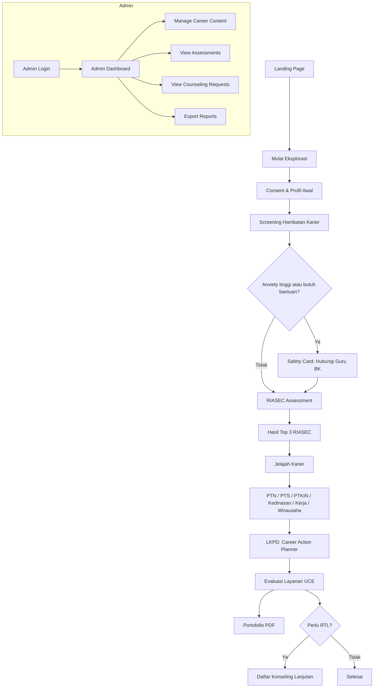

<div align="center">


# RuangKarier

**Platform Bimbingan Karier Berbasis CBT & RIASEC untuk Siswa SMA/MA**

[](https://nextjs.org/)
[](https://react.dev/)
[](https://www.typescriptlang.org/)
[](https://tailwindcss.com/)
[](LICENSE)
[](#)

> *Membantu siswa SMA/MA menjelajahi potensi karier, mengatasi kecemasan akademik, dan menyusun rencana aksi nyata — dalam satu platform terintegrasi.*

[🚀 Demo Langsung](#-cara-menjalankan) · [📖 Dokumentasi](#-dokumentasi) · [🐛 Laporkan Bug](https://github.com/lightnet19/ruangkarier/issues) · [✨ Minta Fitur](https://github.com/lightnet19/ruangkarier/issues)

</div>

---

## 📋 Daftar Isi

- [Tentang Proyek](#-tentang-proyek)
- [Fitur Utama](#-fitur-utama)
- [Landasan Teoritis](#-landasan-teoritis)
- [Arsitektur Aplikasi](#-arsitektur-aplikasi)
- [Alur Kerja Siswa](#-alur-kerja-siswa)
- [Tech Stack](#-tech-stack)
- [Cara Menjalankan](#-cara-menjalankan)
- [Kredensial Akses](#-kredensial-akses)
- [Struktur Direktori](#-struktur-direktori)
- [Dokumentasi](#-dokumentasi)
- [Kontribusi](#-kontribusi)
- [Lisensi](#-lisensi)

---

## 🎯 Tentang Proyek

**RuangKarier** adalah platform bimbingan karier digital yang dirancang khusus untuk siswa SMA dan MA di Indonesia. Platform ini bukan sekadar aplikasi pengisian formulir biasa — melainkan sebuah ruang refleksi yang cerdas, empatik, dan terukur secara akademis.

Dibangun di atas fondasi tiga teori konseling terkemuka: **Teori Karier Donald Super**, **Tipologi RIASEC John Holland**, dan **Cognitive Behavioral Therapy (CBT)**, platform ini memandu siswa melalui 6 langkah sistematis untuk:

- 🔍 **Memahami diri** melalui asesmen minat bakat RIASEC Holland (30 item)
- 🛡️ **Mendeteksi & mengatasi** kecemasan akademik pasca-kelulusan secara adaptif
- 🗺️ **Menjelajahi** jalur karier yang sesuai dengan kepribadian unik mereka
- ✍️ **Menyusun** rencana aksi nyata melalui LKPD restrukturisasi kognitif CBT
- 📊 **Mengevaluasi** proses bimbingan dengan skala UCE (Understanding, Comfort, Action)
- 📁 **Menghasilkan** portofolio karier digital yang siap dicetak

> **Status Pengembangan:** Prototipe Fase 5 — Flatfile Database, siap uji pengguna.

---

## ✨ Fitur Utama

### 👩‍🎓 Untuk Siswa

| Fitur | Deskripsi |
|:---|:---|
| **Wizard 6 Langkah** | Panduan bimbingan sistematis dari *Informed Consent* hingga Portofolio |
| **Skrining Hambatan Karier** | Deteksi hambatan internal & eksternal dengan 8 butir instrumen |
| **Safety Alert Real-Time** | Modal intervensi otomatis saat skor kecemasan ≥ 8 atau siswa membutuhkan bantuan |
| **Asesmen RIASEC Holland** | 30 item kuis minat bakat dengan kalkulasi 6 dimensi kepribadian native |
| **Rekomendasi Jalur Cerdas** | Kartu jalur karier ber-tag ⭐ sesuai Holland Code dominan siswa |
| **LKPD CBT Digital** | Lembar kerja restrukturisasi kognitif interaktif dengan 5 kolom esai |
| **Evaluasi UCE** | Skala pemahaman, kenyamanan, dan tindakan pasca-bimbingan |
| **Portofolio Digital** | Laporan resmi dengan kop surat sekolah, radar chart SVG, & layout cetak |
| **Offline-First** | Data tersimpan aman di localStorage selama pengerjaan |

### 👨‍🏫 Untuk Guru BK / Konselor

| Fitur | Deskripsi |
|:---|:---|
| **Dashboard Analitik** | KPI real-time: penurunan kecemasan, distribusi RIASEC, tingkat penyelesaian |
| **Radar Chart RIASEC** | Visualisasi sebaran tipe Holland seluruh siswa |
| **Red-Flag Alert Feed** | Daftar prioritas siswa dengan kecemasan tinggi (berkode warna) |
| **Database Siswa** | Tabel lengkap data pengerjaan dengan fitur hapus per-siswa atau bulk |
| **Rencana Tindak Lanjut** | Rekap permintaan konseling lanjutan dari siswa |
| **WhatsApp Integration** | Tombol WA direct-link untuk kontak cepat siswa berkebutuhan khusus |
| **Mock Seeder** | Injeksi 3 data siswa simulasi untuk keperluan demonstrasi |

### 👑 Untuk Administrator

| Fitur | Deskripsi |
|:---|:---|
| **Dashboard Admin** | KPI terpusat, distribusi RIASEC, analitik reduksi kecemasan |
| **Manajemen Data Siswa** | Tabel sortable & filterable, aksi hapus, lihat portofolio |
| **Pratinjau Konten Karier** | Preview 6 jalur karier dalam tampilan kartu premium |
| **Permintaan Konseling** | Daftar RTL siswa dengan delta kecemasan & catatan diskusi |
| **Ekspor Laporan** | Unduh data dalam format **JSON** atau **CSV** (kompatibel Excel/Sheets) |
| **Pengaturan Sistem** | Edit nama sekolah, passcode Guru BK, & passcode Admin |

---

## 🧠 Landasan Teoritis

Platform RuangKarier dibangun di atas sintesis tiga teori akademik yang kuat:

```
┌─────────────────────────────────────────────────────────────────┐
│                    FONDASI TEORITIS RUANGKARIER                 │
│                                                                 │
│  1. 📈 TEORI KARIER DONALD SUPER (Life-Span, Life-Space)        │
│     Siswa SMA berada pada fase Eksplorasi (usia 15-24 tahun).   │
│     Platform memfasilitasi sub-tahap Tentative: menjajaki       │
│     minat, menyaring pilihan, & merefleksikan karier realistis. │
│                                                                 │
│  2. 🔷 TIPOLOGI RIASEC JOHN HOLLAND                             │
│     6 tipe kepribadian: Realistic · Investigative · Artistic    │
│     Social · Enterprising · Conventional                        │
│     → Menghasilkan Holland Code 3 huruf (contoh: EAI, ISC)     │
│                                                                 │
│  3. 🧩 COGNITIVE BEHAVIORAL THERAPY (CBT)                       │
│     Restrukturisasi kognitif untuk mengatasi kecemasan           │
│     akademik & graduation anxiety melalui pembongkaran          │
│     pikiran negatif & pembentukan keyakinan afirmatif baru.     │
└─────────────────────────────────────────────────────────────────┘
```

---

## 🏗️ Arsitektur Aplikasi

### Peta Alur Sistem



### Logika Algoritma RIASEC

Skor 30 item (skala 1–5) dipetakan ke 6 dimensi Holland:

| Dimensi | Deskripsi | Item Soal |
|:---:|:---|:---:|
| **R** — Realistic | Praktis, mekanis, bekerja dengan tangan | 1–5 |
| **I** — Investigative | Analitis, ilmiah, penelitian | 6–10 |
| **A** — Artistic | Kreatif, ekspresi diri, seni | 11–15 |
| **S** — Social | Membantu orang lain, komunikatif | 16–20 |
| **E** — Enterprising | Kepemimpinan, bisnis, persuasif | 21–25 |
| **C** — Conventional | Teratur, administratif, data | 26–30 |

3 dimensi tertinggi diekstraksi menjadi **Holland Code** (contoh: `EAI`, `ISC`, `RCI`).

### Logika Safety Trigger

```
Skor Kecemasan = AcademicPressure + GraduationAnxiety

Jika (Skor ≥ 8) ATAU (needsImmediateHelp = true):
  → Tampilkan AlertModal intervensi
  → Tandai siswa sebagai Red Flag
  → Rekam di database untuk prioritas BK
```

---

## 🔄 Alur Kerja Siswa

Wizard bimbingan dipandu melalui **6 Langkah Mandiri**:

```
Langkah 1   →   Langkah 2   →   Langkah 3   →   Langkah 4   →   Langkah 5   →   Langkah 6
                                                                                      
Informed        Skrining        Deteksi         Asesmen         LKPD CBT &        Evaluasi
Consent &       Hambatan        Kecemasan       RIASEC          Rekomendasi       UCE &
Profil Awal     Karier          Real-Time       Holland         Karier            Portofolio
```

---

## 💻 Tech Stack

| Kategori | Teknologi | Versi |
|:---|:---|:---|
| **Framework** | Next.js (App Router) | 16.2.6 |
| **Runtime UI** | React | 19.2.4 |
| **Bahasa** | TypeScript | 5.x |
| **Styling** | Tailwind CSS | 4.x |
| **Ikon** | Lucide React | 1.17+ |
| **Database** | Flatfile JSON (`data/db.json`) | — |
| **Font** | Plus Jakarta Sans, Inter (Google Fonts) | — |
| **Deployment** | Netlify / Vercel (rekomendasi) | — |

### Desain Sistem Warna

| Token | Warna | Nilai HEX | Makna |
|:---|:---:|:---:|:---|
| `primary` | 🟦 | `#1B2A4A` | Navy Blue — Stabilitas & Profesionalisme |
| `secondary` | 🟩 | `#7BA08A` | Sage Green — Ketenangan & Pertumbuhan |
| `accent` | 🟨 | `#F5A623` | Warm Amber — Optimisme & Safety Alert |
| `background` | 🟫 | `#FAF6F1` | Warm Beige — Ramah mata, nyaman |

---

## 🚀 Cara Menjalankan

### Prasyarat

- **Node.js** ≥ 18.x
- **npm** ≥ 9.x

### 1. Clone Repositori

```bash
git clone https://github.com/lightnet19/ruangkarier.git
cd ruangkarier/ruangkarier-app
```

### 2. Install Dependensi

```bash
npm install
```

### 3. Jalankan Development Server

```bash
npm run dev
```

Buka browser dan akses: **[http://localhost:3000](http://localhost:3000)**

### 4. Build Produksi

```bash
# Windows (PowerShell)
cmd /c npm run build

# Linux / macOS
npm run build
```

> ✅ Build berhasil dikompilasi 100% tanpa error — 18 rute statis & dinamis.

---

## 🔑 Kredensial Akses

> ⚠️ **Penting:** Kredensial ini hanya untuk keperluan prototipe. Ganti sebelum deployment produksi.

| Peran | URL Akses | Passcode |
|:---|:---|:---:|
| **Administrator** | [`/admin`](http://localhost:3000/admin) | `admin123` |
| **Guru BK / Konselor** | [`/counselor`](http://localhost:3000/counselor) | `konselor123` |
| **Siswa** | [`/student`](http://localhost:3000/student) | *(tanpa sandi)* |

Passcode disimpan dalam `ruangkarier-app/data/db.json` dan dapat diubah melalui:
- Panel Admin → **Pengaturan** (`/admin/settings`)
- Langsung edit file `data/db.json` (development)

---

## 📁 Struktur Direktori

```
ruangkarier/
├── 📄 README.md                      # Dokumentasi ini
├── 📁 docs/                          # Dokumentasi proyek lengkap
│   ├── devlog.md                     # Log pengembangan harian
│   ├── devplan.md                    # Rencana pengembangan
│   ├── RuangKarier_PRD_Final.md      # Product Requirements Document (PRD)
│   ├── RuangKarier_Sitemap.mmd       # Sitemap (Mermaid diagram)
│   ├── RuangKarier_Sitemap.png       # Sitemap (gambar)
│   ├── RuangKarier_schema.sql        # Skema database SQL (referensi)
│   ├── design.md                     # Panduan desain & sistem warna
│   ├── implementation_plan.md        # Rencana implementasi teknis
│   └── walkthrough_results.md        # Hasil walkthrough & uji kompilasi
│
├── 🖼️ Logo Ruang Karier (Final).png  # Aset logo resmi
├── 🖼️ Icon Ruang Karier.png          # Aset ikon resmi
│
└── 📁 ruangkarier-app/               # Aplikasi Next.js utama
    ├── data/
    │   └── db.json                   # Flatfile database (siswa, settings)
    ├── public/
    │   ├── logo.png                  # Logo untuk web
    │   └── icon.png                  # Favicon & ikon app
    └── src/
        ├── app/
        │   ├── page.tsx              # Landing Page
        │   ├── layout.tsx            # Root Layout global
        │   ├── globals.css           # Global styles
        │   ├── student/page.tsx      # Wizard Bimbingan Siswa (6 langkah)
        │   ├── counselor/page.tsx    # Dashboard Guru BK
        │   ├── portfolio/[id]/       # Halaman Portofolio Siswa
        │   ├── admin/                # Dashboard Admin (6 sub-halaman)
        │   │   ├── page.tsx          # Dashboard utama admin
        │   │   ├── assessments/      # Data asesmen siswa
        │   │   ├── career-content/   # Pratinjau konten karier
        │   │   ├── counseling-requests/ # Permintaan konseling
        │   │   ├── reports/          # Ekspor laporan
        │   │   └── settings/         # Pengaturan sistem
        │   └── api/
        │       ├── student/submit/   # Simpan data pengerjaan siswa
        │       ├── counselor/
        │       │   ├── students/     # CRUD data siswa (BK)
        │       │   └── seed/         # Mock data seeder
        │       └── admin/
        │           ├── auth/         # Autentikasi admin
        │           ├── data/         # Analitik & manajemen data
        │           └── reports/      # Ekspor JSON & CSV
        ├── components/
        │   ├── Navbar.tsx            # Navigasi premium sticky
        │   ├── AlertModal.tsx        # Modal intervensi kecemasan
        │   └── RiasecChart.tsx       # Radar Chart SVG interaktif
        ├── hooks/
        │   └── useLocalStorage.ts    # Offline-first state persistence
        ├── data/
        │   ├── riasecQuestions.ts    # 30 item instrumen RIASEC
        │   └── careerContent.ts      # 6 jalur pendidikan & karier
        └── lib/
            └── flatfileDb.ts         # Utility baca/tulis database JSON
```

---

## 🗺️ Roadmap Pengembangan

### ✅ Fase 5 (Selesai) — Prototipe Flatfile Database
- [x] Wizard bimbingan 6 langkah siswa
- [x] Dashboard analitik Guru BK
- [x] Admin Dashboard lengkap (6 halaman)
- [x] Flatfile JSON database (`data/db.json`)
- [x] API routes autentikasi & manajemen data
- [x] Ekspor laporan JSON & CSV
- [x] Branding visual resmi (logo & ikon)
- [x] Perbaikan render loop & stabilitas sistem

### 🔮 Fase 6 (Direncanakan) — Migrasi ke Production Database
- [ ] Migrasi dari flatfile ke **Supabase** (PostgreSQL)
- [ ] Sistem autentikasi berbasis session/JWT yang lebih aman
- [ ] Notifikasi real-time Guru BK (WebSocket)
- [ ] Ekspor **Portofolio PDF** otomatis (server-side rendering)
- [ ] Multi-tenant: support banyak sekolah dalam satu instance
- [ ] PWA (Progressive Web App) untuk akses offline

---

## 📖 Dokumentasi

Dokumentasi teknis lengkap tersedia di folder [`docs/`](./docs/):

| Dokumen | Deskripsi |
|:---|:---|
| [`RuangKarier_PRD_Final.md`](./docs/RuangKarier_PRD_Final.md) | Product Requirements Document — referensi teknis utama |
| [`devlog.md`](./docs/devlog.md) | Log pengembangan harian & keputusan teknis |
| [`devplan.md`](./docs/devplan.md) | Rencana & strategi pengembangan per fase |
| [`design.md`](./docs/design.md) | Panduan sistem desain visual & warna |
| [`implementation_plan.md`](./docs/implementation_plan.md) | Rencana implementasi teknis detail |
| [`RuangKarier_Sitemap.mmd`](./docs/RuangKarier_Sitemap.mmd) | Sitemap diagram (Mermaid) |
| [`RuangKarier_schema.sql`](./docs/RuangKarier_schema.sql) | Skema database SQL untuk referensi migrasi |

---

## 🤝 Kontribusi

Kontribusi sangat kami sambut! Berikut cara berkontribusi:

1. **Fork** repositori ini
2. **Buat branch** fitur baru (`git checkout -b feature/fitur-baru`)
3. **Commit** perubahan Anda (`git commit -m 'feat: tambah fitur baru'`)
4. **Push** ke branch (`git push origin feature/fitur-baru`)
5. Buat **Pull Request**

### Panduan Commit Message

Gunakan konvensi [Conventional Commits](https://www.conventionalcommits.org/):

```
feat:     Menambah fitur baru
fix:      Memperbaiki bug
docs:     Perubahan dokumentasi
style:    Perubahan formatting (tidak mempengaruhi logika)
refactor: Refaktorisasi kode
test:     Menambah/memperbaiki test
chore:    Perubahan konfigurasi/tooling
```

---

## 👥 Tentang Pengembang

Proyek ini dikembangkan sebagai prototipe aplikasi bimbingan karier berbasis teknologi untuk mendukung layanan Bimbingan dan Konseling (BK) di sekolah-sekolah Indonesia.

> *"RuangKarier hadir untuk menjadi jembatan antara potensi siswa dan masa depan yang mereka impikan."*

---

## 📄 Lisensi

Proyek ini dilisensikan di bawah **MIT License** — lihat file [LICENSE](LICENSE) untuk detail lengkap.

---

<div align="center">

**Dibuat dengan ❤️ untuk siswa Indonesia**

[](https://github.com/lightnet19/ruangkarier)
[](https://github.com/lightnet19/ruangkarier/issues)
[](https://github.com/lightnet19/ruangkarier/stargazers)

</div>
