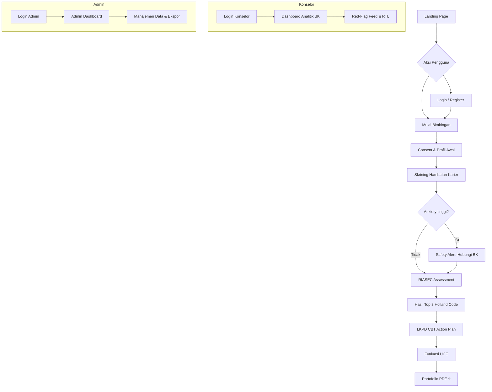

<div align="center">


# RuangKarier

**Portal Bimbingan Karier Mandiri Adaptif Berbasis CBT & RIASEC Holland**

*Untuk siswa SMA/SMK/MA Indonesia yang mempersiapkan masa depan karier mereka*

[](https://nextjs.org/)
[](https://react.dev/)
[](https://www.typescriptlang.org/)
[](https://tailwindcss.com/)
[](https://pptr.dev/)
[](LICENSE)
[](https://ruangkarier.vercel.app/)

> *Membantu siswa SMA/MA menjelajahi potensi karier, mengatasi kecemasan akademik, dan menyusun rencana aksi nyata — dalam satu platform terintegrasi.*

[🚀 Demo Langsung](https://ruangkarier.vercel.app/) · [📖 Dokumentasi](#-dokumentasi) · [🐛 Laporkan Bug](https://github.com/lightnet19/ruangkarier/issues) · [✨ Minta Fitur](https://github.com/lightnet19/ruangkarier/issues)

</div>

---

## 📋 Daftar Isi

- [Tentang Proyek](#-tentang-proyek)
- [Fitur Lengkap](#-fitur-lengkap)
- [Landasan Teoritis](#-landasan-teoritis)
- [Arsitektur & Alur Sistem](#-arsitektur--alur-sistem)
- [Peta Rute Aplikasi](#-peta-rute-aplikasi-sitemap)
- [Tech Stack](#-tech-stack)
- [Cara Menjalankan](#-cara-menjalankan)
- [Kredensial Akses & Data Demo](#-kredensial-akses--data-demo)
- [Struktur Direktori](#-struktur-direktori)
- [Server-Side PDF Generation](#-server-side-pdf-generation)
- [API Routes](#-api-routes)
- [Dokumentasi](#-dokumentasi)
- [Roadmap](#-roadmap-pengembangan)
- [Kontribusi](#-kontribusi)
- [Lisensi](#-lisensi)

---

## 🎯 Tentang Proyek

**RuangKarier** adalah platform bimbingan karier digital yang dirancang khusus untuk siswa SMA dan MA di Indonesia. Platform ini bukan sekadar aplikasi pengisian formulir biasa — melainkan sebuah ruang refleksi yang cerdas, empatik, dan terukur secara akademis.

Dibangun di atas fondasi tiga teori konseling terkemuka: **Teori Karier Donald Super**, **Tipologi RIASEC John Holland**, dan **Cognitive Behavioral Therapy (CBT)**, platform ini memandu siswa melalui langkah-langkah sistematis untuk:

- 🔍 **Memahami diri** melalui asesmen minat bakat RIASEC Holland (30 item)
- 🛡️ **Mendeteksi & mengatasi** kecemasan akademik pasca-kelulusan secara adaptif
- 🗺️ **Menjelajahi** jalur karier yang sesuai dengan kepribadian unik mereka
- ✍️ **Menyusun** rencana aksi nyata melalui LKPD restrukturisasi kognitif CBT
- 📊 **Mengevaluasi** proses bimbingan dengan skala UCE (Understanding, Comfort, Action)
- 📁 **Menghasilkan** portofolio karier digital berkualitas tinggi yang siap dicetak

> **Status Pengembangan:** Fase 6 selesai (PDF + Login + Auth). Fase 7 (Supabase + Database Karier) sedang direncanakan.

---

## ✨ Fitur Lengkap

### 👨‍🎓 Untuk Siswa

| Fitur | Deskripsi |
|:---|:---|
| **Registrasi & Login** | Daftar akun baru atau masuk dengan Student ID yang sudah ada |
| **Informed Consent** | Lembar persetujuan kerahasiaan data BK sebelum memulai sesi |
| **Skrining Hambatan Karier** | Deteksi hambatan internal & eksternal dengan 6 butir instrumen (S1–S6) |
| **Safety Alert Real-Time** | Modal intervensi otomatis saat skor kecemasan ≥ 8 atau siswa membutuhkan bantuan |
| **Asesmen RIASEC Holland** | 30 item kuis minat bakat dengan kalkulasi 6 dimensi kepribadian |
| **Radar Chart SVG** | Visualisasi interaktif hasil RIASEC dalam bentuk spider/radar chart |
| **Rekomendasi Jalur Cerdas** | Kartu jalur karier ber-tag ⭐ sesuai Holland Code dominan siswa |
| **LKPD CBT Digital** | Lembar kerja restrukturisasi kognitif: pikiran negatif → keyakinan baru |
| **Komitmen Bulanan** | Daftar komitmen aksi nyata dan rencana tindak lanjut |
| **Evaluasi UCE** | Skala pemahaman, kenyamanan, dan tindakan pasca-bimbingan |
| **Portofolio PDF** | Ekspor dokumen portofolio mandiri A4 berkualitas tinggi (server-side Puppeteer) |
| **Offline-First** | Data tersimpan aman di localStorage selama pengerjaan |

### 👩‍🏫 Untuk Guru BK / Konselor

| Fitur | Deskripsi |
|:---|:---|
| **Dashboard Analitik** | KPI real-time: rata-rata penurunan kecemasan, distribusi RIASEC, tingkat penyelesaian |
| **Red-Flag Alert Feed** | Daftar prioritas siswa dengan kecemasan tinggi (berkode warna) |
| **Database Siswa** | Tabel lengkap data pengerjaan dengan filter, hapus per-siswa atau bulk |
| **Rencana Tindak Lanjut** | Rekap permintaan konseling lanjutan dari siswa |
| **WhatsApp Integration** | Tombol WA direct-link untuk kontak cepat siswa berkebutuhan khusus |
| **Mock Seeder** | Injeksi 3 data siswa simulasi untuk keperluan demonstrasi |

### 👑 Untuk Administrator

| Fitur | Deskripsi |
|:---|:---|
| **Dashboard Admin** | KPI terpusat, distribusi RIASEC, analitik reduksi kecemasan |
| **Manajemen Data Siswa** | Tabel sortable & filterable, aksi hapus, lihat portofolio |
| **Pratinjau Konten Karier** | Preview 6 jalur karier dalam tampilan kartu premium |
| **Permintaan Konseling** | Daftar RTL siswa dengan delta kecemasan & catatan diskusi |
| **Ekspor Laporan** | Unduh data dalam format **JSON** atau **CSV** (kompatibel Excel/Sheets) |
| **Pengaturan Sistem** | Edit nama sekolah, passcode Guru BK, & passcode Admin |

---

## 🧠 Landasan Teoritis

Platform RuangKarier dibangun di atas sintesis tiga teori akademik yang kuat:

```
┌─────────────────────────────────────────────────────────────────┐
│                    FONDASI TEORITIS RUANGKARIER                 │
│                                                                 │
│  1. 📈 TEORI KARIER DONALD SUPER (Life-Span, Life-Space)        │
│     Siswa SMA berada pada fase Eksplorasi (usia 15-24 tahun).   │
│     Platform memfasilitasi sub-tahap Tentative: menjajaki       │
│     minat, menyaring pilihan, & merefleksikan karier realistis. │
│                                                                 │
│  2. 🔷 TIPOLOGI RIASEC JOHN HOLLAND                             │
│     6 tipe kepribadian: Realistic · Investigative · Artistic    │
│     Social · Enterprising · Conventional                        │
│     → Menghasilkan Holland Code 3 huruf (contoh: EAI, ISC)     │
│                                                                 │
│  3. 🧩 COGNITIVE BEHAVIORAL THERAPY (CBT)                       │
│     Restrukturisasi kognitif untuk mengatasi kecemasan           │
│     akademik & graduation anxiety melalui pembongkaran          │
│     pikiran negatif & pembentukan keyakinan afirmatif baru.     │
└─────────────────────────────────────────────────────────────────┘
```

### Logika Algoritma RIASEC

Skor 30 item (skala 1–5) dipetakan ke 6 dimensi Holland:

| Dimensi | Deskripsi | Item Soal |
|:---:|:---|:---:|
| **R** — Realistic | Praktis, mekanis, bekerja dengan tangan | 1–5 |
| **I** — Investigative | Analitis, ilmiah, penelitian | 6–10 |
| **A** — Artistic | Kreatif, ekspresi diri, seni | 11–15 |
| **S** — Social | Membantu orang lain, komunikatif | 16–20 |
| **E** — Enterprising | Kepemimpinan, bisnis, persuasif | 21–25 |
| **C** — Conventional | Teratur, administratif, data | 26–30 |

3 dimensi tertinggi diekstraksi menjadi **Holland Code** (contoh: `EAI`, `ISC`, `RCI`).

---

## 🏗️ Arsitektur & Alur Sistem



### Logika Safety Trigger

```
Skor Kecemasan = AcademicPressure + GraduationAnxiety

Jika (Skor ≥ 8) ATAU (needsImmediateHelp = true):
  → Tampilkan AlertModal intervensi
  → Tandai siswa sebagai Red Flag di database
  → Masuk ke prioritas antrian konseling BK
```

---

## 🗺️ Peta Rute Aplikasi (Sitemap)

```
/                          → Landing page publik
├── /login                 → Login siswa, admin, & konselor (multi-role tab)
├── /register              → Registrasi akun siswa baru
│
├── /student               → Wizard bimbingan siswa (7 langkah)
│   └── Consent | Profil | Skrining | Kecemasan | RIASEC | CBT Plan | Evaluasi
│
├── /portfolio/[id]        → Portofolio mandiri siswa (printable + PDF export)
│
├── /counselor             → Dashboard Guru BK (passcode-protected)
│
└── /admin                 → Dashboard Admin (passcode-protected)
    ├── /admin/assessments
    ├── /admin/career-content
    ├── /admin/counseling-requests
    ├── /admin/reports
    └── /admin/settings
```

---

## 💻 Tech Stack

| Kategori | Teknologi | Versi |
|:---|:---|:---|
| **Framework** | [Next.js](https://nextjs.org) (App Router) | 16.2.6 |
| **Runtime UI** | [React](https://react.dev) | 19.2.4 |
| **Bahasa** | [TypeScript](https://www.typescriptlang.org) | 5.x |
| **Styling** | [Tailwind CSS v4](https://tailwindcss.com) | 4.x |
| **Ikon** | [Lucide React](https://lucide.dev) | 1.17+ |
| **PDF Engine** | [Puppeteer](https://pptr.dev) (Headless Chromium) | ^25.1 |
| **Database** | Flat-file JSON (`data/db.json`) | — |
| **Font** | Plus Jakarta Sans, Inter (Google Fonts) | — |
| **Deployment** | Vercel | [ruangkarier.vercel.app](https://ruangkarier.vercel.app/) |

### Desain Sistem Warna

| Token | Warna | HEX | Makna |
|:---|:---:|:---:|:---|
| `primary` | 🟦 | `#1B2A4A` | Navy Blue — Stabilitas & Profesionalisme |
| `secondary` | 🟩 | `#7BA08A` | Sage Green — Ketenangan & Pertumbuhan |
| `accent` | 🟨 | `#F5A623` | Warm Amber — Optimisme & Safety Alert |
| `background` | 🟫 | `#FAF6F1` | Warm Beige — Ramah mata, nyaman |

---

## 🚀 Cara Menjalankan

### Prasyarat
- **Node.js** ≥ 20.x
- **npm** ≥ 10.x

### 1. Clone Repositori

```bash
git clone https://github.com/lightnet19/ruangkarier.git
cd ruangkarier/ruangkarier-app
```

### 2. Install Dependensi

```bash
npm install --legacy-peer-deps
```

### 3. Jalankan Development Server

```bash
npm run dev
```

Buka browser dan akses: **[http://localhost:3000](http://localhost:3000)**

### 4. Build Produksi

```bash
# Windows (PowerShell)
npm.cmd run build

# Linux / macOS
npm run build
```

> ✅ Build berhasil dikompilasi 100% tanpa error — 22 rute statis & dinamis.

---

## 🔑 Kredensial Akses & Data Demo

> ⚠️ **Penting:** Kredensial ini hanya untuk keperluan prototipe. Ganti sebelum deployment produksi melalui `/admin/settings`.

### Akses Login

| Peran | URL | Passcode |
|:---|:---|:---:|
| **Administrator** | `/login` → tab Admin | `admin123` |
| **Guru BK / Konselor** | `/login` → tab Konselor | `konselor123` |
| **Siswa** | `/login` → tab Siswa | Student ID + Nama |

### Data Demo Siswa

Gunakan Student ID berikut untuk langsung melihat portofolio tanpa mengisi wizard:

| Nama | Student ID | Kelas | URL Portofolio |
|:---|:---|:---|:---|
| Ahmad Fauzi | `mock_ahmad_fauzi` | XII-MIPA-1 | `/portfolio/mock_ahmad_fauzi` |
| Siti Rahayu | `mock_siti_rahayu` | XII-IPS-2 | `/portfolio/mock_siti_rahayu` |
| Budi Santoso | `mock_budi_santoso` | XII-MIPA-3 | `/portfolio/mock_budi_santoso` |

---

## 📁 Struktur Direktori

```
ruangkarier/
├── 📄 README.md                         # Dokumentasi ini (satu-satunya README)
├── 📁 docs/                             # Dokumentasi proyek lengkap
│   ├── devlog.md                        # Log pengembangan harian
│   ├── devplan.md                       # Rencana pengembangan per fase
│   ├── RuangKarier_PRD_Final.md         # Product Requirements Document
│   ├── RuangKarier_Sitemap.mmd          # Sitemap (Mermaid diagram)
│   ├── RuangKarier_schema.sql           # Skema database SQL (referensi)
│   ├── design.md                        # Panduan desain & sistem warna
│   └── implementation_plan.md           # Rencana implementasi teknis
│
└── 📁 ruangkarier-app/                  # Kode sumber aplikasi Next.js
    ├── data/
    │   └── db.json                      # Flatfile database (siswa, admin, konselor)
    ├── public/
    │   ├── logo.png                     # Logo resmi RuangKarier
    │   └── icon.png                     # Favicon & ikon aplikasi
    └── src/
        ├── app/
        │   ├── page.tsx                 # Landing Page
        │   ├── layout.tsx               # Root Layout global
        │   ├── globals.css              # Design tokens, print CSS, glassmorphism
        │   ├── login/page.tsx           # Login multi-role (Siswa/Konselor/Admin)
        │   ├── register/page.tsx        # Registrasi akun siswa baru
        │   ├── student/page.tsx         # Wizard Bimbingan Siswa (7 langkah)
        │   ├── counselor/page.tsx       # Dashboard Guru BK
        │   ├── portfolio/[id]/page.tsx  # Portofolio Siswa + PDF Export
        │   ├── admin/                   # Dashboard Admin (6 sub-halaman)
        │   └── api/
        │       ├── student/submit/      # Simpan & ambil data pengerjaan
        │       ├── student/auth/        # Login siswa
        │       ├── counselor/auth/      # Login konselor
        │       ├── counselor/students/  # CRUD data siswa (BK)
        │       ├── counselor/seed/      # Mock data seeder
        │       ├── admin/auth/          # Autentikasi admin
        │       ├── admin/data/          # Analitik & manajemen data
        │       ├── admin/reports/       # Ekspor JSON & CSV
        │       └── portfolio/generate-pdf/ # ⭐ Server-side PDF (Puppeteer)
        ├── components/
        │   ├── Navbar.tsx               # Navigasi premium sticky
        │   └── RiasecChart.tsx          # Radar Chart SVG interaktif
        ├── hooks/
        │   └── useLocalStorage.ts       # Offline-first state persistence
        ├── data/
        │   ├── riasecQuestions.ts       # 30 item instrumen RIASEC
        │   └── careerContent.ts         # 6 jalur pendidikan & karier
        └── lib/
            └── flatfileDb.ts            # Utility baca/tulis/cari database JSON
```

---

## 📄 Server-Side PDF Generation

Portofolio diekspor sebagai PDF berkualitas tinggi menggunakan **Puppeteer (Headless Chromium)** di sisi server — bukan canvas browser.

### Alur Kerja

```
Siswa klik "Unduh PDF"
  → GET /api/portfolio/generate-pdf?id={student_id}
    → Puppeteer launch Headless Chromium (viewport 1200×1600, deviceScaleFactor: 2)
      → Navigate ke /portfolio/{id}
        → emulateMediaType('print') — sembunyikan navbar/tombol via .no-print
          → pdf({ format: 'A4', printBackground: true })
            → Return binary stream → Auto-download di browser
```

### Keunggulan vs Client-Side

| Aspek | Client-Side (html2canvas) | Server-Side (Puppeteer) ✅ |
|:---|:---:|:---:|
| SVG Radar Chart | ❌ Sering blank/pixelated | ✅ Sempurna, vektor tajam |
| CSS Gradien/Glassmorphism | ❌ Warna hilang | ✅ Dipertahankan penuh |
| Font kustom (Google Fonts) | ❌ Fallback ke default | ✅ Termuat sempurna |
| Ukuran bundle klien | ❌ +500KB library | ✅ Zero client overhead |
| Kontrol layout print | ❌ Terbatas | ✅ CSS `@media print` penuh |

### Catatan Deployment Serverless

Untuk Vercel / Netlify Functions, ganti `puppeteer` → `puppeteer-core` + `@sparticuz/chromium`:

```typescript
import chromium from '@sparticuz/chromium';
import puppeteer from 'puppeteer-core';

const browser = await puppeteer.launch({
  args: chromium.args,
  executablePath: await chromium.executablePath(),
  headless: chromium.headless,
});
```

---

## 🔌 API Routes

| Endpoint | Method | Fungsi |
|:---|:---:|:---|
| `/api/student/submit` | GET / POST | Ambil atau simpan data pengerjaan siswa |
| `/api/student/auth` | POST | Login siswa (Student ID + Nama) |
| `/api/counselor/auth` | POST | Login konselor (passcode) |
| `/api/counselor/students` | GET / DELETE | Kelola data siswa dari panel BK |
| `/api/counselor/seed` | POST | Inject 3 data dummy siswa |
| `/api/admin/auth` | POST / PATCH | Login & ganti passcode admin |
| `/api/admin/data` | GET / DELETE / PATCH | Data siswa + pengaturan sistem |
| `/api/admin/reports` | GET | Ekspor semua data (JSON / CSV) |
| `/api/portfolio/generate-pdf` | GET | Generate PDF portofolio server-side |

---

## 📖 Dokumentasi

Dokumentasi teknis lengkap tersedia di folder [`docs/`](./docs/):

| Dokumen | Deskripsi |
|:---|:---|
| [`competitive_analysis_roadmap.md`](./docs/competitive_analysis_roadmap.md) | ⭐ Analisis kompetitor & roadmap Fase 7–10 (dokumen terbaru) |
| [`devplan.md`](./docs/devplan.md) | Rencana pengembangan per fase + status terkini + panduan kontributor |
| [`RuangKarier_PRD_Final.md`](./docs/RuangKarier_PRD_Final.md) | Product Requirements Document — referensi teknis utama |
| [`devlog.md`](./docs/devlog.md) | Log pengembangan harian & keputusan teknis |
| [`design.md`](./docs/design.md) | Panduan sistem desain visual & warna |
| [`implementation_plan.md`](./docs/implementation_plan.md) | Rencana implementasi teknis detail |

---

## 🗺️ Roadmap Pengembangan

### ✅ Selesai
- [x] **Fase 1** — Fondasi & sistem desain (Next.js, TailwindCSS, glassmorphism)
- [x] **Fase 2** — Instrumen RIASEC Holland (30 item) & CBT LKPD
- [x] **Fase 3** — Wizard siswa 7 langkah, Safety Alert, Evaluasi UCE
- [x] **Fase 4** — Portofolio cetak, Dashboard BK, WhatsApp integration
- [x] **Fase 5** — Flatfile database server-side, sinkronisasi API real-time
- [x] **Fase 6a** — Admin Dashboard lengkap (6 halaman, auth, ekspor JSON/CSV)
- [x] **Fase 6b** — Server-Side PDF generation (Puppeteer headless, retina quality)
- [x] **Fase 6c** — Halaman Login/Register & Auth API multi-role

### 🔮 Direncanakan (berdasarkan analisis kompetitor)
- [ ] **Fase 7** — Migrasi ke Supabase (PostgreSQL + Auth JWT) + Database Karier 200+ profesi
- [ ] **Fase 8** — UX enhancement: one-question UI, persona Holland Indonesia, multi-battery assessment
- [ ] **Fase 9** — B2B multi-tenant sekolah: kode akses, AKPD digital, pricing tier
- [ ] **Fase 10** — AI Career Counselor (Gemini API), portofolio web interaktif, PWA

> 📄 Detail lengkap: [competitive_analysis_roadmap.md](./docs/competitive_analysis_roadmap.md) | [devplan.md](./docs/devplan.md)

---

## 🤝 Kontribusi

Kontribusi sangat kami sambut! Berikut cara berkontribusi:

1. **Fork** repositori ini
2. **Buat branch** fitur baru (`git checkout -b feature/fitur-baru`)
3. **Commit** perubahan Anda (`git commit -m 'feat: tambah fitur baru'`)
4. **Push** ke branch (`git push origin feature/fitur-baru`)
5. Buat **Pull Request**

### Panduan Commit Message

Gunakan konvensi [Conventional Commits](https://www.conventionalcommits.org/):

```
feat:     Menambah fitur baru
fix:      Memperbaiki bug
docs:     Perubahan dokumentasi
style:    Perubahan formatting (tidak mempengaruhi logika)
refactor: Refaktorisasi kode
chore:    Perubahan konfigurasi/tooling
```

---

## 👥 Tentang Pengembang

Proyek ini dikembangkan sebagai prototipe aplikasi bimbingan karier berbasis teknologi untuk mendukung layanan Bimbingan dan Konseling (BK) di sekolah-sekolah Indonesia.

> *"RuangKarier hadir untuk menjadi jembatan antara potensi siswa dan masa depan yang mereka impikan."*

---

## 📄 Lisensi

Proyek ini dilisensikan di bawah **MIT License** — lihat file [LICENSE](LICENSE) untuk detail lengkap.

---

<div align="center">

**Dibuat dengan ❤️ untuk siswa Indonesia**

[](https://github.com/lightnet19/ruangkarier)
[](https://github.com/lightnet19/ruangkarier/issues)
[](https://github.com/lightnet19/ruangkarier/stargazers)

</div>
