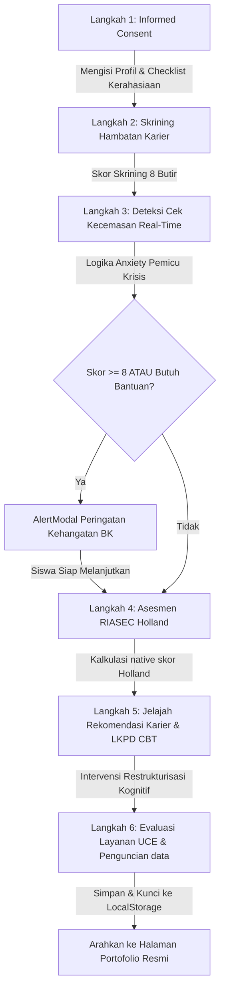

# 👑 Product Requirements Document (PRD) Final — RuangKarier

> **Versi:** 1.0 (Final Production Blueprint)  
> **Status:** Siap Produksi / Siap Migrasi Flatfile Database & PDF Engine  
> **Author:** Antigravity AI  
> **Deskripsi:** Dokumen acuan tunggal (*Single Source of Truth*) yang menggabungkan sintesis konseptual, arsitektur file Next.js yang sudah terimplementasi, skema database Flatfile JSON komprehensif, logika fungsional, serta rencana aksi migrasi flatfile database untuk kelanjutan proyek.

---

## 🧭 1. Landasan Teoretis & Akademis (Academic Foundation)

Platform **RuangKarier** bukan sekadar aplikasi pengisian formulir biasa, melainkan dirancang berdasarkan sintesis kuat dari tiga teori bimbingan dan psikologi konseling:

1.  **Teori Perkembangan Karier Donald Super (Life-Span, Life-Space):**
    *   Siswa SMA/MA berada pada tahap **Exploration (Eksplorasi - Usia 15–24 tahun)**. Platform memfasilitasi sub-tahap *Tentative* (tentatif) di mana siswa menjajaki minat, menyaring pilihan karier, dan merefleksikan pilihan realistis.
2.  **Teori Tipologi Kepribadian RIASEC John Holland:**
    *   Asesmen mencakup 6 tipe kepribadian: *Realistic (R)*, *Investigative (I)*, *Artistic (A)*, *Social (S)*, *Enterprising (E)*, dan *Conventional (C)*. Platform memetakan minat aktivitas siswa ke 3 kode huruf dominan (*Holland Code*).
3.  **Restrukturisasi Kognitif Cognitive Behavioral Therapy (CBT):**
    *   Mengatasi kecemasan masa depan pasca-kelulusan (*graduation anxiety*) dan tekanan akademik (*academic pressure*) melalui pembongkaran pikiran otomatis negatif (*negative automatic thoughts*), penimbangan bukti objektif (*cognitive restructuring*), penetapan afirmasi keyakinan baru, dan komitmen aksi adaptif.

---

## 🎨 2. Palet Desain & Estetika Premium (Sistem Desain)

Sesuai dengan `docs/design.md`, aplikasi menerapkan antarmuka premium berkonsep **Safe Space** yang menenangkan dan profesional:
*   **Navy Blue (`#1B2A4A` / `primary`):** Melambangkan stabilitas, masa depan, dan kredibilitas profesional.
*   **Sage Green (`#7BA08A` / `secondary`):** Menghadirkan rasa tenang, pertumbuhan, dan penerimaan diri.
*   **Warm Amber (`#F5A623` / `accent`):** Menandakan optimisme, kehangatan, serta penunjuk prioritas (*Safety Trigger*).
*   **Warm Beige (`#FAF6F1` / `background`):** Warna dasar latar belakang yang ramah mata siswa dan mengurangi ketegangan psikologis.
*   **Glassmorphism (`backdrop-blur-md bg-white/75 border border-white/20`):** Memberikan kedalaman antarmuka modern pada elemen melayang seperti Navbar dan Dialog Modal.

---

## 📂 3. Arsitektur File & Kode Terimplementasi (Next.js 16+ App Router)

Proyek ini telah dikembangkan dengan struktur folder modular dan bersih di dalam direktori `ruangkarier-app/`:

```plaintext
ruangkarier-app/
├── src/
│   ├── app/
│   │   ├── layout.tsx            # Shell global dengan font Plus Jakarta Sans & Inter
│   │   ├── page.tsx              # Landing Page interaktif (4 Card Dashboard kemajuan)
│   │   ├── globals.css           # Konfigurasi Tailwind CSS v4, custom utility, & @media print
│   │   ├── student/
│   │   │   └── page.tsx          # Wizard Bimbingan Siswa (Informed Consent -> Refleksi Akhir)
│   │   ├── counselor/
│   │   │   └── page.tsx          # Dasbor Guru BK (Analitik KPI, Live Alerts Red-Flag, & Database)
│   │   └── portfolio/
│   │       └── [id]/
│   │           └── page.tsx      # Laporan Portofolio Siswa (Kop Surat Resmi, Radar SVG, & layout cetak)
│   ├── components/
│   │   ├── AlertModal.tsx        # Modal Krisis Kecemasan Siswa (WhatsApp BK deeplink)
│   │   ├── Navbar.tsx            # Navigasi sticky premium (UserCog Counselor Link)
│   │   └── RiasecChart.tsx       # Radar Chart SVG murni interaktif dengan strict typing
│   ├── hooks/
│   │   └── useLocalStorage.ts    # Utility sinkronisasi state klien offline-first
│   └── data/
│       ├── riasecQuestions.ts    # Repositori 30 item instrumen kuis RIASEC Holland
│       └── careerContent.ts      # Repositori 6 jalur pendidikan kelulusan ter-tagging RIASEC
```

---

## 🔄 4. Logika Alur Kerja Detak Sistem (System Workflows)

### 4.1. Alur Stepper Wizard Siswa (`/student`)
Siswa dipandu secara berurutan lewat 6 Langkah Mandiri:



*   **Logika Pemicu Peringatan (Safety Trigger):**
    Di dalam `student/page.tsx` langkah 3:
    $$\text{Score} = \text{academicPressure} + \text{graduationAnxiety}$$
    Jika $\text{Score} \ge 8$ ATAU siswa menekan opsi *Membutuhkan Bantuan Segera*, state `showAlertModal` diset ke `true`, menampilkan modal intervensi keselamatan yang ramah. Siswa secara otomatis terdaftar sebagai prioritas tindak lanjut (*Red Flag*).

*   **Algoritma RIASEC Holland:**
    30 item soal dengan skala 1-5 dipetakan secara simetris ke dimensi R, I, A, S, E, C. 3 dimensi tertinggi diekstraksi menjadi kode badge utama (misalnya: *SEC*, *IAS*). Prosedur memetakan bintang ⭐ khusus pada kartu jalur pendidikan di Langkah 5 jika huruf pertamanya cocok dengan kode Holland siswa.

*   **LKPD Restrukturisasi Kognitif CBT:**
    Tingkat kecemasan tinggi diatasi melalui 5 esai restrukturisasi kognitif:
    1.  *Pikiran Otomatis Negatif*
    2.  *Bukti Pendukung*
    3.  *Fakta Penyeimbang Kontradiktif*
    4.  *Sudut Pandang Alternatif yang Konstruktif*
    5.  *Pernyataan Keyakinan Afirmatif Baru*
    Diikuti komitmen minimal memilih 3 aksi nyata adaptif dan menuliskan 3 target aksi bulanan.

---

## 📊 5. Skema Struktur Database Flatfile JSON

Untuk meminimalkan ketergantungan pada infrastruktur pihak ketiga (seperti Supabase/PostgreSQL) dan menjaga proyek tetap portabel serta hemat biaya sebagai purwarupa (*prototype*), platform **RuangKarier** menggunakan database berbasis berkas datar (**Flatfile Database**) dalam bentuk file JSON tunggal: `data/db.json` di root direktori proyek.

Struktur data JSON ini didesain agar kompatibel penuh dengan state visual pengerjaan siswa dan antarmuka Guru BK di dasbor konselor.

### 5.1. Skema Struktur Berkas `data/db.json`

Berikut adalah cetak biru format penyimpanan berkas JSON (`data/db.json`):

```json
{
  "students": [
    {
      "id": "std_229bd926_1d4e",
      "profile": {
        "name": "Budi Santoso",
        "nisn": "0081234567",
        "className": "XII MIPA 1",
        "school": "SMA Negeri Pilihan",
        "initialConfidence": 4,
        "mainProblem": "Ragu memilih jurusan Kuliah Teknik Elektro karena tekanan ekonomi keluarga.",
        "preparationNotes": "Ingin bekerja paruh waktu sembari kuliah jika memungkinkan."
      },
      "consent": {
        "consentChecked": true,
        "timestamp": "2026-05-30T08:15:00.000Z"
      },
      "screening": {
        "internalBarriers": 12,
        "externalBarriers": 8,
        "responses": {
          "IB_01": 2,
          "IB_02": 3,
          "EB_01": 1
        }
      },
      "anxietyLog": {
        "academicPressure": 9,
        "graduationAnxiety": 8,
        "needsImmediateHelp": true,
        "triggeredAlert": true,
        "counselorNotified": false,
        "timestamp": "2026-05-30T08:17:00.000Z"
      },
      "riasec": {
        "totals": {
          "R": 12,
          "I": 24,
          "A": 15,
          "S": 22,
          "E": 18,
          "C": 14
        },
        "hollandCode": "ISC",
        "timestamp": "2026-05-30T08:22:00.000Z"
      },
      "actionPlan": {
        "goal": "Menjadi Software Engineer Rumpun Teknik / IT",
        "challengeLevel": 8,
        "emotions": ["Khawatir", "Antusias"],
        "negativeThought": "Saya takut gagal lolos UTBK dan membebani finansial orang tua jika kuliah swasta.",
        "evidenceNegative": "Biaya kuliah swasta sangat mahal dan persaingan beasiswa ketat.",
        "counterEvidence": "Ada skema KIP-Kuliah dan program magang berbayar yang bisa diambil.",
        "alternativeView": "Saya akan berusaha maksimal di ujian negeri dan mencari alternatif beasiswa swasta sejak awal.",
        "newBelief": "Saya memiliki kecerdasan untuk berjuang dan opsi pembiayaan kuliah sangat beragam jika proaktif.",
        "commitments": [
          "Mempelajari materi UTBK kuantitatif setiap hari selama 30 menit",
          "Mencari 3 informasi beasiswa penuh universitas swasta sebagai cadangan",
          "Berdiskusi secara terbuka dengan Guru BK sekolah mengenai opsi KIP-Kuliah"
        ],
        "monthlyGoals": [
          "Bulan 1: Menyelesaikan rangkuman materi dasar saintek",
          "Bulan 2: Mengikuti uji coba (tryout) UTBK mandiri",
          "Bulan 3: Mendaftar jalur seleksi nasional SNBP/SNBT"
        ]
      },
      "evaluation": {
        "understanding": 9,
        "comfort": 8,
        "action": 9,
        "notes": "Konseling adaptif ini sangat membantu mengurangi kecemasan saya secara logis.",
        "timestamp": "2026-05-30T08:25:00.000Z"
      },
      "status": "completed",
      "createdAt": "2026-05-30T08:15:00.000Z",
      "updatedAt": "2026-05-30T08:25:00.000Z"
    }
  ],
  "counselorSettings": {
    "passcode": "BK2026",
    "schoolName": "SMA Negeri Pilihan",
    "updatedAt": "2026-05-30T08:00:00.000Z"
  }
}
```

---

## ⚡ 6. Blueprints Teknis Rencana Tindak Lanjut (Langkah Kelanjutan)

Berikut adalah panduan kode dan instruksi teknis langkah-demi-langkah bagi pengembang untuk menerapkan **Fase 5 (Flatfile Database)** dan **Fase 6 (PDF Engine)** secara mulus:

### ⚡ 6.1. Langkah Migrasi Database Flatfile JSON

Untuk menggantikan `localStorage` agar Guru BK dapat menarik dan memantau data pengerjaan siswa secara terpusat dari komputer terpisah (server lokal/VPS yang sama), ikuti blueprint arsitektur serverless API flatfile berikut:

#### 1. Pembuatan Helper Utility Flatfile (`src/lib/flatfileDb.ts`)

Buat berkas server-side utility untuk membaca, menulis, dan menginisialisasi berkas JSON secara aman dari sisi API Next.js:

```typescript
import fs from 'fs/promises';
import path from 'path';

// Direktori tempat db.json disimpan di luar folder build
const DB_PATH = path.join(process.cwd(), 'data', 'db.json');

// Interface Struktur Database
export interface StudentData {
  id: string;
  profile: {
    name: string;
    nisn: string;
    className: string;
    school: string;
    initialConfidence: number;
    mainProblem: string;
    preparationNotes: string;
  };
  consent?: {
    consentChecked: boolean;
    timestamp: string;
  };
  screening?: {
    internalBarriers: number;
    externalBarriers: number;
    responses: Record<string, number>;
  };
  anxietyLog?: {
    academicPressure: number;
    graduationAnxiety: number;
    needsImmediateHelp: boolean;
    triggeredAlert: boolean;
    counselorNotified: boolean;
    timestamp: string;
  };
  riasec?: {
    totals: Record<string, number>;
    hollandCode: string;
    timestamp: string;
  };
  actionPlan?: {
    goal: string;
    challengeLevel: number;
    emotions: string[];
    negativeThought: string;
    evidenceNegative: string;
    counterEvidence: string;
    alternativeView: string;
    newBelief: string;
    commitments: string[];
    monthlyGoals: string[];
  };
  evaluation?: {
    understanding: number;
    comfort: number;
    action: number;
    notes: string;
    timestamp: string;
  };
  status: 'active' | 'completed';
  createdAt: string;
  updatedAt: string;
}

export interface DbSchema {
  students: StudentData[];
  counselorSettings: {
    passcode: string;
    schoolName: string;
    updatedAt: string;
  };
}

// Inisialisasi berkas database kosong jika tidak ada
async function ensureDbExists() {
  try {
    const dir = path.dirname(DB_PATH);
    await fs.mkdir(dir, { recursive: true });
    await fs.access(DB_PATH);
  } catch {
    const defaultData: DbSchema = {
      students: [],
      counselorSettings: {
        passcode: "BK2026",
        schoolName: "SMA Negeri Pilihan",
        updatedAt: new Date().toISOString()
      }
    };
    await fs.writeFile(DB_PATH, JSON.stringify(defaultData, null, 2), 'utf-8');
  }
}

// Membaca Database Flatfile
export async function readDb(): Promise<DbSchema> {
  await ensureDbExists();
  const rawData = await fs.readFile(DB_PATH, 'utf-8');
  return JSON.parse(rawData) as DbSchema;
}

// Menulis kembali ke Database Flatfile
export async function writeDb(data: DbSchema): Promise<void> {
  await ensureDbExists();
  // Thread-safe atomic write menggunakan file sementara (.tmp)
  const tmpPath = `${DB_PATH}.tmp`;
  await fs.writeFile(tmpPath, JSON.stringify(data, null, 2), 'utf-8');
  await fs.rename(tmpPath, DB_PATH);
}
```

#### 2. Pembuatan API Route Handler Next.js

Buat endpoint API untuk menerima data dari formulir wizard siswa:

##### A. Endpoint Menyimpan Data Siswa (`src/app/api/student/submit/route.ts`)

```typescript
import { NextResponse } from 'next/server';
import { readDb, writeDb, StudentData } from '@/lib/flatfileDb';

export async function POST(request: Request) {
  try {
    const body = await request.json();
    const { id, profile, consent, screening, anxietyLog, riasec, actionPlan, evaluation, status } = body;

    if (!id || !profile?.name) {
      return NextResponse.json({ error: 'ID siswa dan nama lengkap wajib diisi.' }, { status: 400 });
    }

    const db = await readDb();
    const nowStr = new Date().toISOString();

    const existingIndex = db.students.findIndex(s => s.id === id);

    const newStudentData: StudentData = {
      id,
      profile,
      consent,
      screening,
      anxietyLog,
      riasec,
      actionPlan,
      evaluation,
      status: status || 'active',
      createdAt: existingIndex > -1 ? db.students[existingIndex].createdAt : nowStr,
      updatedAt: nowStr
    };

    if (existingIndex > -1) {
      db.students[existingIndex] = newStudentData;
    } else {
      db.students.push(newStudentData);
    }

    await writeDb(db);
    return NextResponse.json({ message: 'Data portofolio sukses disimpan!', data: newStudentData });
  } catch (error: any) {
    return NextResponse.json({ error: error.message }, { status: 500 });
  }
}
```

##### B. Endpoint Guru BK Mengambil Data Siswa (`src/app/api/counselor/students/route.ts`)

```typescript
import { NextResponse } from 'next/server';
import { readDb } from '@/lib/flatfileDb';

export async function GET(request: Request) {
  try {
    const { searchParams } = new URL(request.url);
    const passcode = searchParams.get('passcode');

    const db = await readDb();

    // Proteksi sandi aksesBK sederhana
    if (!passcode || passcode !== db.counselorSettings.passcode) {
      return NextResponse.json({ error: 'Kode sandi Guru BK tidak valid!' }, { status: 403 });
    }

    return NextResponse.json({ 
      schoolName: db.counselorSettings.schoolName,
      students: db.students 
    });
  } catch (error: any) {
    return NextResponse.json({ error: error.message }, { status: 500 });
  }
}
```

##### C. Endpoint Seeder Simulasi Data Guru BK (`src/app/api/counselor/seed/route.ts`)

```typescript
import { NextResponse } from 'next/server';
import { readDb, writeDb } from '@/lib/flatfileDb';

export async function POST(request: Request) {
  try {
    const db = await readDb();
    
    // Tambahkan minimal 3 dummy data simulasi beranekaragam untuk Guru BK
    const dummyStudents = [
      {
        id: "std_mock_01",
        profile: {
          name: "Rian Hidayat",
          nisn: "0083214569",
          className: "XII IPS 2",
          school: db.counselorSettings.schoolName,
          initialConfidence: 3,
          mainProblem: "Kurang percaya diri menghadapi seleksi kerja setelah lulus SMK/SMA.",
          preparationNotes: "Ingin bekerja membantu keuangan adik-adiknya."
        },
        consent: { consentChecked: true, timestamp: new Date().toISOString() },
        anxietyLog: {
          academicPressure: 9,
          graduationAnxiety: 9,
          needsImmediateHelp: true,
          triggeredAlert: true,
          counselorNotified: false,
          timestamp: new Date().toISOString()
        },
        riasec: {
          totals: { R: 25, I: 12, A: 10, S: 18, E: 24, C: 15 },
          hollandCode: "RES",
          timestamp: new Date().toISOString()
        },
        actionPlan: {
          goal: "Membuka bengkel motor mandiri (Wirausaha)",
          challengeLevel: 7,
          emotions: ["Takut", "Bersemangat"],
          negativeThought: "Saya tidak memiliki modal sepeser pun untuk membeli peralatan.",
          evidenceNegative: "Sewa ruko dan alat perkakas bengkel sangat mahal.",
          counterEvidence: "Saya bisa mulai magang dulu atau bermitra dengan bengkel lain untuk berbagi tempat.",
          alternativeView: "Saya akan mengumpulkan tabungan dari bekerja di bengkel lain sembari belajar manajemen.",
          newBelief: "Modal terbesar adalah keahlian praktik saya; uang bisa dicari bertahap.",
          commitments: ["Mengikuti magang BLK selama 3 bulan", "Menyusun rincian kebutuhan alat paling dasar", "Membantu bengkel paman saat liburan sekolah"],
          monthlyGoals: ["Bulan 1: Lolos sertifikasi BLK", "Bulan 2: Membeli toolkit dasar", "Bulan 3: Mulai servis panggilan keliling"]
        },
        evaluation: { understanding: 8, comfort: 9, action: 9, notes: "Membantu!", timestamp: new Date().toISOString() },
        status: "completed" as const,
        createdAt: new Date().toISOString(),
        updatedAt: new Date().toISOString()
      }
    ];

    db.students = [...db.students.filter(s => !s.id.startsWith("std_mock")), ...dummyStudents];
    await writeDb(db);
    
    return NextResponse.json({ message: 'Dummy data simulasi berhasil disuntikkan ke db.json!', count: dummyStudents.length });
  } catch (error: any) {
    return NextResponse.json({ error: error.message }, { status: 500 });
  }
}
```

#### 3. Rencana Pengiriman Data dari Wizard (`student/page.tsx`)

Ubah fungsi penyimpanan akhir di langkah 6 untuk melakukan request API `fetch` asinkron:

```typescript
const handleFinalSubmit = async (fullData: any) => {
  try {
    const response = await fetch('/api/student/submit', {
      method: 'POST',
      headers: { 'Content-Type': 'application/json' },
      body: JSON.stringify(fullData)
    });

    if (!response.ok) {
      throw new Error("Gagal mengunggah data ke server.");
    }

    const resJson = await response.json();
    console.log("Portofolio berhasil disimpan ke database flatfile server:", resJson);
    
    // Sebagai fallback keamanan cadangan, tetap simpan di localStorage
    localStorage.setItem('ruangkarier_active_session', JSON.stringify(fullData));
    
    // Arahkan ke halaman portofolio siswa
    router.push(`/portfolio/${fullData.id}`);
  } catch (err) {
    console.error("Terjadi kegagalan sinkronisasi database:", err);
  }
};
```

---

### ⚡ 6.2. Langkah Integrasi Ekspor PDF Otomatis Sisi Klien

Meskipun saat ini platform sudah teruji sangat rapi saat dicetak via perintah `window.print()` (menggunakan media-print CSS), di **Phase 6** Anda dapat menghadirkan tombol unduh PDF satu-klik langsung tanpa dialog print browser.

#### 1. Instalasi Library
Instal dependensi `html2pdf.js` (alternatif pembungkus `html2canvas` dan `jsPDF` yang andal menjaga rasio CSS):
```bash
npm install html2pdf.js
```

#### 2. Pembuatan Fungsi Ekspor Pintar di `portfolio/[id]/page.tsx`
Tambahkan impor dinamis di halaman portofolio untuk mencegah error Server-Side Rendering (SSR) Next.js karena pustaka PDF membutuhkan objek `window` browser:

```typescript
'use client';
import React, { useRef } from 'react';

export default function StudentPortfolio() {
  const reportRef = useRef<HTMLDivElement>(null);

  const handleDownloadPDF = async () => {
    // Impor modul secara dinamis hanya di sisi klien
    const html2pdf = (await import('html2pdf.js')).default;
    
    const element = reportRef.current;
    if (!element) return;

    // Sembunyikan tombol aksi selama proses pengambilan gambar
    const actionButtons = document.getElementById('action-buttons');
    if (actionButtons) actionButtons.style.display = 'none';

    const options = {
      margin: [10, 10, 10, 10], // Margin halaman [atas, kiri, bawah, kanan]
      filename: `Portofolio_RuangKarier_${Date.now()}.pdf`,
      image: { type: 'jpeg', quality: 0.98 },
      html2canvas: { 
        scale: 2, // Meningkatkan kerapatan piksel agar teks & grafik tidak blur
        useCORS: true, 
        logging: false 
      },
      jsPDF: { unit: 'mm', format: 'a4', orientation: 'portrait' }
    };

    try {
      await html2pdf().set(options).from(element).save();
    } catch (error) {
      console.error("Gagal mengekspor berkas portofolio PDF:", error);
    } finally {
      // Tampilkan kembali tombol aksi
      if (actionButtons) actionButtons.style.display = 'flex';
    }
  };

  return (
    <div className="min-h-screen bg-warm-beige p-6">
      {/* Bar Aksi atas */}
      <div id="action-buttons" className="max-w-4xl mx-auto flex justify-end gap-3 mb-6 no-print">
        <button 
          onClick={handleDownloadPDF}
          className="px-5 py-2.5 bg-secondary text-white rounded-lg font-medium hover:bg-opacity-90 transition cursor-pointer"
        >
          Unduh PDF Langsung
        </button>
        <button 
          onClick={() => window.print()}
          className="px-5 py-2.5 bg-primary text-white rounded-lg font-medium hover:bg-opacity-90 transition cursor-pointer"
        >
          Cetak Dokumen
        </button>
      </div>

      {/* Kontainer Portofolio Laporan Resmi */}
      <div ref={reportRef} className="print-card max-w-4xl mx-auto bg-white p-12 border border-slate-100 rounded-2xl shadow-sm">
        {/* Kop Surat & Rincian Portofolio... */}
      </div>
    </div>
  );
}
```

---

## 🚀 7. Petunjuk Deployment Aplikasi (Vercel & Netlify)

Aplikasi siap dideploy ke platform awan utama seperti Vercel (sangat direkomendasikan untuk Next.js) atau Netlify:

### 7.1. Deploy ke Vercel (Metode 1 - Tercepat)
1.  Buat akun di [Vercel](https://vercel.com).
2.  Hubungkan akun GitHub Anda (`lightnet19`) dan impor repositori `ruangkarier`.
3.  Di dalam panel Vercel, pilih direktori proyek: `ruangkarier-app`.
4.  Konfigurasi Variabel Lingkungan (Environment Variables) jika Supabase sudah siap:
    *   `NEXT_PUBLIC_SUPABASE_URL` = `https://<kode-proyek>.supabase.co`
    *   `NEXT_PUBLIC_SUPABASE_ANON_KEY` = `<kunci-anon-proyek>`
5.  Klik tombol **Deploy**. Vercel akan otomatis mendeteksi konfigurasi Next.js, mengompilasi rute statis/dinamis, dan memberikan domain produksi HTTPS gratis!

---

## 🎯 8. Indikator Keberhasilan Penerapan (Success Metrics)

*   **Completion Rate:** $\ge 85\%$ siswa menuntaskan langkah konseling dari Informed Consent hingga LKPD akhir.
*   **Keakuratan Deteksi Alarm Kecemasan:** $100\%$ akurat mengidentifikasi siswa ber-skor kecemasan $\ge 8$ dan menampilkannya di jajaran teratas live alert feed Guru BK.
*   **Stabilitas Ekspor Dokumen:** Berkas portofolio PDF tercetak rapi dengan margin kertas A4 tanpa ada pemotongan visual diagram radar RIASEC.
*   **Kecepatan Memuat (Performance):** Halaman memiliki nilai First Contentful Paint (FCP) $\le 1.5$ detik pada jaringan seluler sekolah.
