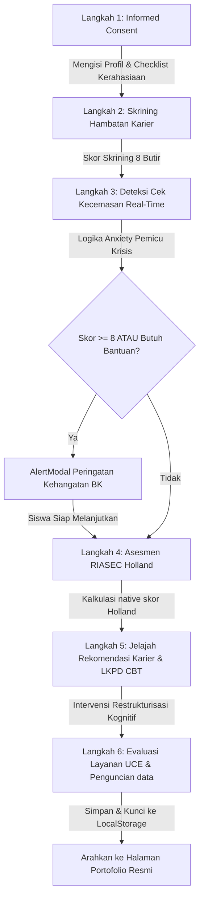

# 👑 Product Requirements Document (PRD) Final — RuangKarier

> **Versi:** 1.0 (Final Production Blueprint)  
> **Status:** Siap Produksi / Siap Migrasi Supabase & PDF Engine  
> **Author:** Antigravity AI  
> **Deskripsi:** Dokumen acuan tunggal (*Single Source of Truth*) yang menggabungkan sintesis konseptual, arsitektur file Next.js yang sudah terimplementasi, skema database PostgreSQL/Supabase komprehensif, logika fungsional, serta rencana aksi migrasi serverless untuk kelanjutan proyek.

---

## 🧭 1. Landasan Teoretis & Akademis (Academic Foundation)

Platform **RuangKarier** bukan sekadar aplikasi pengisian formulir biasa, melainkan dirancang berdasarkan sintesis kuat dari tiga teori bimbingan dan psikologi konseling:

1.  **Teori Perkembangan Karier Donald Super (Life-Span, Life-Space):**
    *   Siswa SMA/MA berada pada tahap **Exploration (Eksplorasi - Usia 15–24 tahun)**. Platform memfasilitasi sub-tahap *Tentative* (tentatif) di mana siswa menjajaki minat, menyaring pilihan karier, dan merefleksikan pilihan realistis.
2.  **Teori Tipologi Kepribadian RIASEC John Holland:**
    *   Asesmen mencakup 6 tipe kepribadian: *Realistic (R)*, *Investigative (I)*, *Artistic (A)*, *Social (S)*, *Enterprising (E)*, dan *Conventional (C)*. Platform memetakan minat aktivitas siswa ke 3 kode huruf dominan (*Holland Code*).
3.  **Restrukturisasi Kognitif Cognitive Behavioral Therapy (CBT):**
    *   Mengatasi kecemasan masa depan pasca-kelulusan (*graduation anxiety*) dan tekanan akademik (*academic pressure*) melalui pembongkaran pikiran otomatis negatif (*negative automatic thoughts*), penimbangan bukti objektif (*cognitive restructuring*), penetapan afirmasi keyakinan baru, dan komitmen aksi adaptif.

---

## 🎨 2. Palet Desain & Estetika Premium (Sistem Desain)

Sesuai dengan `docs/design.md`, aplikasi menerapkan antarmuka premium berkonsep **Safe Space** yang menenangkan dan profesional:
*   **Navy Blue (`#1B2A4A` / `primary`):** Melambangkan stabilitas, masa depan, dan kredibilitas profesional.
*   **Sage Green (`#7BA08A` / `secondary`):** Menghadirkan rasa tenang, pertumbuhan, dan penerimaan diri.
*   **Warm Amber (`#F5A623` / `accent`):** Menandakan optimisme, kehangatan, serta penunjuk prioritas (*Safety Trigger*).
*   **Warm Beige (`#FAF6F1` / `background`):** Warna dasar latar belakang yang ramah mata siswa dan mengurangi ketegangan psikologis.
*   **Glassmorphism (`backdrop-blur-md bg-white/75 border border-white/20`):** Memberikan kedalaman antarmuka modern pada elemen melayang seperti Navbar dan Dialog Modal.

---

## 📂 3. Arsitektur File & Kode Terimplementasi (Next.js 16+ App Router)

Proyek ini telah dikembangkan dengan struktur folder modular dan bersih di dalam direktori `ruangkarier-app/`:

```plaintext
ruangkarier-app/
├── src/
│   ├── app/
│   │   ├── layout.tsx            # Shell global dengan font Plus Jakarta Sans & Inter
│   │   ├── page.tsx              # Landing Page interaktif (4 Card Dashboard kemajuan)
│   │   ├── globals.css           # Konfigurasi Tailwind CSS v4, custom utility, & @media print
│   │   ├── student/
│   │   │   └── page.tsx          # Wizard Bimbingan Siswa (Informed Consent -> Refleksi Akhir)
│   │   ├── counselor/
│   │   │   └── page.tsx          # Dasbor Guru BK (Analitik KPI, Live Alerts Red-Flag, & Database)
│   │   └── portfolio/
│   │       └── [id]/
│   │           └── page.tsx      # Laporan Portofolio Siswa (Kop Surat Resmi, Radar SVG, & layout cetak)
│   ├── components/
│   │   ├── AlertModal.tsx        # Modal Krisis Kecemasan Siswa (WhatsApp BK deeplink)
│   │   ├── Navbar.tsx            # Navigasi sticky premium (UserCog Counselor Link)
│   │   └── RiasecChart.tsx       # Radar Chart SVG murni interaktif dengan strict typing
│   ├── hooks/
│   │   └── useLocalStorage.ts    # Utility sinkronisasi state klien offline-first
│   └── data/
│       ├── riasecQuestions.ts    # Repositori 30 item instrumen kuis RIASEC Holland
│       └── careerContent.ts      # Repositori 6 jalur pendidikan kelulusan ter-tagging RIASEC
```

---

## 🔄 4. Logika Alur Kerja Detak Sistem (System Workflows)

### 4.1. Alur Stepper Wizard Siswa (`/student`)
Siswa dipandu secara berurutan lewat 6 Langkah Mandiri:



*   **Logika Pemicu Peringatan (Safety Trigger):**
    Di dalam `student/page.tsx` langkah 3:
    $$\text{Score} = \text{academicPressure} + \text{graduationAnxiety}$$
    Jika $\text{Score} \ge 8$ ATAU siswa menekan opsi *Membutuhkan Bantuan Segera*, state `showAlertModal` diset ke `true`, menampilkan modal intervensi keselamatan yang ramah. Siswa secara otomatis terdaftar sebagai prioritas tindak lanjut (*Red Flag*).

*   **Algoritma RIASEC Holland:**
    30 item soal dengan skala 1-5 dipetakan secara simetris ke dimensi R, I, A, S, E, C. 3 dimensi tertinggi diekstraksi menjadi kode badge utama (misalnya: *SEC*, *IAS*). Prosedur memetakan bintang ⭐ khusus pada kartu jalur pendidikan di Langkah 5 jika huruf pertamanya cocok dengan kode Holland siswa.

*   **LKPD Restrukturisasi Kognitif CBT:**
    Tingkat kecemasan tinggi diatasi melalui 5 esai restrukturisasi kognitif:
    1.  *Pikiran Otomatis Negatif*
    2.  *Bukti Pendukung*
    3.  *Fakta Penyeimbang Kontradiktif*
    4.  *Sudut Pandang Alternatif yang Konstruktif*
    5.  *Pernyataan Keyakinan Afirmatif Baru*
    Diikuti komitmen minimal memilih 3 aksi nyata adaptif dan menuliskan 3 target aksi bulanan.

---

## 📊 5. Skema Relasional Database PostgreSQL & Supabase

Untuk melanjutkan integrasi database online penuh di **Phase 5**, berikut skema skrip SQL PostgreSQL lengkap yang kompatibel dengan tabel data dan model relasional di dalam aplikasi:

```sql
-- ==========================================
-- 1. TABEL UTAMA PENGGUNA (USERS)
-- ==========================================
CREATE TABLE users (
  id UUID PRIMARY KEY DEFAULT gen_random_uuid(),
  role VARCHAR(20) NOT NULL CHECK (role IN ('student', 'counselor', 'admin')),
  name VARCHAR(150) NOT NULL,
  email VARCHAR(150) UNIQUE,
  school VARCHAR(150),
  class_name VARCHAR(50),
  student_code VARCHAR(50), -- NISN / Kode Akses Kelas
  session_code VARCHAR(20),  -- Menghubungkan bimbingan massal kelas
  status VARCHAR(20) NOT NULL DEFAULT 'active',
  created_at TIMESTAMP NOT NULL DEFAULT NOW(),
  updated_at TIMESTAMP NOT NULL DEFAULT NOW()
);

-- ==========================================
-- 2. INFORMED CONSENT & KELUHAN AWAL
-- ==========================================
CREATE TABLE consent_sessions (
  id UUID PRIMARY KEY DEFAULT gen_random_uuid(),
  user_id UUID NOT NULL REFERENCES users(id) ON DELETE CASCADE,
  consent_checked BOOLEAN NOT NULL DEFAULT FALSE,
  confidence_score INTEGER CHECK (confidence_score BETWEEN 1 AND 10),
  main_problem TEXT,
  preparation_notes TEXT,
  created_at TIMESTAMP NOT NULL DEFAULT NOW()
);

-- ==========================================
-- 3. JAWABAN SKRINING HAMBATAN KARIER (0 - 4)
-- ==========================================
CREATE TABLE screening_responses (
  id UUID PRIMARY KEY DEFAULT gen_random_uuid(),
  user_id UUID NOT NULL REFERENCES users(id) ON DELETE CASCADE,
  item_code VARCHAR(50) NOT NULL,
  category VARCHAR(50) NOT NULL, -- Internal / Eksternal
  score INTEGER NOT NULL CHECK (score BETWEEN 0 AND 4),
  created_at TIMESTAMP NOT NULL DEFAULT NOW()
);

-- ==========================================
-- 4. LOG DETEKSI DINI KECEMASAN (RED FLAGS)
-- ==========================================
CREATE TABLE anxiety_logs (
  id UUID PRIMARY KEY DEFAULT gen_random_uuid(),
  user_id UUID NOT NULL REFERENCES users(id) ON DELETE CASCADE,
  academic_pressure INTEGER CHECK (academic_pressure BETWEEN 1 AND 10),
  graduation_anxiety INTEGER CHECK (graduation_anxiety BETWEEN 1 AND 10),
  needs_immediate_help BOOLEAN DEFAULT FALSE,
  triggered_alert BOOLEAN DEFAULT FALSE,
  counselor_notified BOOLEAN DEFAULT FALSE,
  created_at TIMESTAMP NOT NULL DEFAULT NOW()
);

-- ==========================================
-- 5. JAWABAN INSTRUMEN KUIS RIASEC (1 - 5)
-- ==========================================
CREATE TABLE riasec_responses (
  id UUID PRIMARY KEY DEFAULT gen_random_uuid(),
  user_id UUID NOT NULL REFERENCES users(id) ON DELETE CASCADE,
  item_no INTEGER NOT NULL CHECK (item_no BETWEEN 1 AND 30),
  dimension CHAR(1) NOT NULL CHECK (dimension IN ('R','I','A','S','E','C')),
  score INTEGER NOT NULL CHECK (score BETWEEN 1 AND 5),
  created_at TIMESTAMP NOT NULL DEFAULT NOW()
);

-- ==========================================
-- 6. HASIL AKUMULATIF TES RIASEC
-- ==========================================
CREATE TABLE riasec_results (
  id UUID PRIMARY KEY DEFAULT gen_random_uuid(),
  user_id UUID NOT NULL REFERENCES users(id) ON DELETE CASCADE,
  r_total INTEGER NOT NULL DEFAULT 0,
  i_total INTEGER NOT NULL DEFAULT 0,
  a_total INTEGER NOT NULL DEFAULT 0,
  s_total INTEGER NOT NULL DEFAULT 0,
  e_total INTEGER NOT NULL DEFAULT 0,
  c_total INTEGER NOT NULL DEFAULT 0,
  top3_code VARCHAR(10) NOT NULL,
  summary_text TEXT,
  created_at TIMESTAMP NOT NULL DEFAULT NOW()
);

-- ==========================================
-- 7. KONTEN MODUL JELAJAH KARIER
-- ==========================================
CREATE TABLE career_modules (
  id UUID PRIMARY KEY DEFAULT gen_random_uuid(),
  title VARCHAR(150) NOT NULL,
  module_type VARCHAR(30) NOT NULL CHECK (module_type IN ('ptn','pts','ptkin','kedinasan','kerja','wirausaha')),
  riasec_tags VARCHAR(30), -- Menghubungkan kecocokan RIASEC
  content TEXT NOT NULL,   -- Data Markdown / HTML ringkasan jalur
  media_url TEXT,
  is_active BOOLEAN NOT NULL DEFAULT TRUE,
  sort_order INTEGER NOT NULL DEFAULT 0,
  created_at TIMESTAMP NOT NULL DEFAULT NOW(),
  updated_at TIMESTAMP NOT NULL DEFAULT NOW()
);

-- ==========================================
-- 8. LEMBAR KERJA LKPD DIGITAL (CBT STRATEGI)
-- ==========================================
CREATE TABLE action_plans (
  id UUID PRIMARY KEY DEFAULT gen_random_uuid(),
  user_id UUID NOT NULL REFERENCES users(id) ON DELETE CASCADE,
  goal TEXT NOT NULL,
  challenge_level INTEGER CHECK (challenge_level BETWEEN 1 AND 10),
  emotion_text TEXT,
  negative_thought TEXT,
  evidence_negative TEXT,
  counter_evidence TEXT,
  alternative_view TEXT,
  new_belief TEXT,
  top_actions JSONB NOT NULL DEFAULT '[]'::jsonb,      -- Kumpulan komitmen aksi
  monthly_actions JSONB NOT NULL DEFAULT '[]'::jsonb,  -- Tiga target utama
  created_at TIMESTAMP NOT NULL DEFAULT NOW(),
  updated_at TIMESTAMP NOT NULL DEFAULT NOW()
);

-- ==========================================
-- 9. EVALUASI LAYANAN BIMBINGAN UCE
-- ==========================================
CREATE TABLE evaluations (
  id UUID PRIMARY KEY DEFAULT gen_random_uuid(),
  user_id UUID NOT NULL REFERENCES users(id) ON DELETE CASCADE,
  understanding_score INTEGER CHECK (understanding_score BETWEEN 1 AND 10),
  comfort_score INTEGER CHECK (comfort_score BETWEEN 1 AND 10),
  action_score INTEGER CHECK (action_score BETWEEN 1 AND 10),
  notes TEXT,
  created_at TIMESTAMP NOT NULL DEFAULT NOW()
);

-- ==========================================
-- 10. ANTRIAN PERMINTAAN KONSELING LAYANAN RTL
-- ==========================================
CREATE TABLE counseling_requests (
  id UUID PRIMARY KEY DEFAULT gen_random_uuid(),
  user_id UUID NOT NULL REFERENCES users(id) ON DELETE CASCADE,
  reason TEXT NOT NULL,
  priority VARCHAR(20) NOT NULL DEFAULT 'normal' CHECK (priority IN ('low', 'normal', 'high', 'urgent')),
  status VARCHAR(20) NOT NULL DEFAULT 'new' CHECK (status IN ('new', 'scheduled', 'done', 'cancelled')),
  counselor_notes TEXT,
  scheduled_at TIMESTAMP,
  created_at TIMESTAMP NOT NULL DEFAULT NOW(),
  updated_at TIMESTAMP NOT NULL DEFAULT NOW()
);

-- ==========================================
-- INDEKS EFISIENSI QUERY (DATABASE INDEXES)
-- ==========================================
CREATE INDEX idx_consent_user_id ON consent_sessions(user_id);
CREATE INDEX idx_screening_user_id ON screening_responses(user_id);
CREATE INDEX idx_anxiety_logs_user_id ON anxiety_logs(user_id);
CREATE INDEX idx_riasec_user_id ON riasec_responses(user_id);
CREATE INDEX idx_riasec_results_user_id ON riasec_results(user_id);
CREATE INDEX idx_action_plans_user_id ON action_plans(user_id);
CREATE INDEX idx_evaluations_user_id ON evaluations(user_id);
CREATE INDEX idx_counseling_requests_user_id ON counseling_requests(user_id);
```

---

## ⚡ 6. Blueprints Teknis Rencana Tindak Lanjut (Langkah Kelanjutan)

Berikut adalah panduan kode dan instruksi teknis langkah-demi-langkah bagi pengembang untuk menerapkan **Fase 5 (Supabase)** dan **Fase 6 (PDF Engine)** secara mulus:

### ⚡ 6.1. Langkah Migrasi Database Online dengan Supabase

Untuk melepaskan ketergantungan pada `localStorage` agar Guru BK dapat menerima data pengerjaan siswa secara real-time dari komputer terpisah:

#### 1. Setup Supabase Client
Instal dependensi `@supabase/supabase-js` pada folder `ruangkarier-app`:
```bash
npm install @supabase/supabase-js
```

Buat file konfigurasi `src/lib/supabaseClient.ts`:
```typescript
import { createClient } from '@supabase/supabase-js';

const supabaseUrl = process.env.NEXT_PUBLIC_SUPABASE_URL || '';
const supabaseAnonKey = process.env.NEXT_PUBLIC_SUPABASE_ANON_KEY || '';

export const supabase = createClient(supabaseUrl, supabaseAnonKey);
```

#### 2. Rencana Pemetaan Sinkronisasi Data Siswa
Ketika siswa menekan tombol **"KIRIM PORTOFOLIO KE GURU BK"** di Langkah 6 (`student/page.tsx`), buat fungsi pengiriman asinkron untuk menggantikan `localStorage.setItem`:

```typescript
import { supabase } from '@/lib/supabaseClient';

async function uploadStudentSession(studentData: any) {
  try {
    // 1. Insert User & Profil
    const { data: user, error: userError } = await supabase
      .from('users')
      .insert([{
        name: studentData.profile.name,
        role: 'student',
        class_name: studentData.profile.className,
        school: 'SMA / MA Negeri Pilihan',
        student_code: studentData.profile.nisn || studentData.id
      }])
      .select()
      .single();

    if (userError) throw userError;

    // 2. Insert Keluhan Awal (Consent)
    await supabase.from('consent_sessions').insert([{
      user_id: user.id,
      consent_checked: true,
      confidence_score: parseInt(studentData.profile.initialConfidence),
      main_problem: studentData.profile.mainProblem,
      preparation_notes: studentData.profile.preparationNotes
    }]);

    // 3. Insert Log Kecemasan (Safety Log)
    await supabase.from('anxiety_logs').insert([{
      user_id: user.id,
      academic_pressure: parseInt(studentData.profile.academicPressure || 0),
      graduation_anxiety: parseInt(studentData.profile.graduationAnxiety || 0),
      needs_immediate_help: studentData.profile.needsImmediateHelp === 'yes',
      triggered_alert: parseInt(studentData.profile.academicPressure || 0) + parseInt(studentData.profile.graduationAnxiety || 0) >= 8
    }]);

    // 4. Insert Hasil RIASEC
    await supabase.from('riasec_results').insert([{
      user_id: user.id,
      r_total: studentData.riasecTotals.R,
      i_total: studentData.riasecTotals.I,
      a_total: studentData.riasecTotals.A,
      s_total: studentData.riasecTotals.S,
      e_total: studentData.riasecTotals.E,
      c_total: studentData.riasecTotals.C,
      top3_code: studentData.hollandCode,
      summary_text: `Menyukai kepribadian dominan tipe ${studentData.hollandCode}`
    }]);

    // 5. Insert LKPD Action Plan
    await supabase.from('action_plans').insert([{
      user_id: user.id,
      goal: studentData.actionPlan.goal,
      challenge_level: parseInt(studentData.actionPlan.challengeLevel),
      emotion_text: studentData.actionPlan.emotions.join(', '),
      negative_thought: studentData.actionPlan.negativeThought,
      evidence_negative: studentData.actionPlan.evidenceNegative,
      counter_evidence: studentData.actionPlan.counterEvidence,
      alternative_view: studentData.actionPlan.alternativeView,
      new_belief: studentData.actionPlan.newBelief,
      top_actions: studentData.actionPlan.commitments,
      monthly_actions: studentData.actionPlan.monthlyGoals
    }]);

    // 6. Insert Evaluasi
    await supabase.from('evaluations').insert([{
      user_id: user.id,
      understanding_score: parseInt(studentData.evaluation.understanding),
      comfort_score: parseInt(studentData.evaluation.comfort),
      action_score: parseInt(studentData.evaluation.action),
      notes: studentData.evaluation.notes
    }]);

    console.log("Data pengerjaan siswa sukses diunggah ke database cloud!");
  } catch (error) {
    console.error("Terjadi kegagalan unggah data ke Supabase:", error);
  }
}
```

#### 3. Keamanan Database RLS (Row Level Security)
Di portal Supabase, aktifkan **Row Level Security (RLS)** pada setiap tabel:
*   Tabel `users`, `career_modules`: Dapat dibaca secara publik oleh anon.
*   Tabel asesmen & detail LKPD (`action_plans`, `riasec_results`, `anxiety_logs`):
    *   **INSERT:** Diizinkan secara anonim/siswa yang sedang mengisi.
    *   **SELECT:** Hanya diizinkan bagi pengguna terotentikasi (*Authenticated*) yang bertindak sebagai Guru BK / Konselor (`role == 'counselor'`).

---

### ⚡ 6.2. Langkah Integrasi Ekspor PDF Otomatis Sisi Klien

Meskipun saat ini platform sudah teruji sangat rapi saat dicetak via perintah `window.print()` (menggunakan media-print CSS), di **Phase 6** Anda dapat menghadirkan tombol unduh PDF satu-klik langsung tanpa dialog print browser.

#### 1. Instalasi Library
Instal dependensi `html2pdf.js` (alternatif pembungkus `html2canvas` dan `jsPDF` yang andal menjaga rasio CSS):
```bash
npm install html2pdf.js
```

#### 2. Pembuatan Fungsi Ekspor Pintar di `portfolio/[id]/page.tsx`
Tambahkan impor dinamis di halaman portofolio untuk mencegah error Server-Side Rendering (SSR) Next.js karena pustaka PDF membutuhkan objek `window` browser:

```typescript
'use client';
import React, { useRef } from 'react';

export default function StudentPortfolio() {
  const reportRef = useRef<HTMLDivElement>(null);

  const handleDownloadPDF = async () => {
    // Impor modul secara dinamis hanya di sisi klien
    const html2pdf = (await import('html2pdf.js')).default;
    
    const element = reportRef.current;
    if (!element) return;

    // Sembunyikan tombol aksi selama proses pengambilan gambar
    const actionButtons = document.getElementById('action-buttons');
    if (actionButtons) actionButtons.style.display = 'none';

    const options = {
      margin: [10, 10, 10, 10], // Margin halaman [atas, kiri, bawah, kanan]
      filename: `Portofolio_RuangKarier_${Date.now()}.pdf`,
      image: { type: 'jpeg', quality: 0.98 },
      html2canvas: { 
        scale: 2, // Meningkatkan kerapatan piksel agar teks & grafik tidak blur
        useCORS: true, 
        logging: false 
      },
      jsPDF: { unit: 'mm', format: 'a4', orientation: 'portrait' }
    };

    try {
      await html2pdf().set(options).from(element).save();
    } catch (error) {
      console.error("Gagal mengekspor berkas portofolio PDF:", error);
    } finally {
      // Tampilkan kembali tombol aksi
      if (actionButtons) actionButtons.style.display = 'flex';
    }
  };

  return (
    <div className="min-h-screen bg-warm-beige p-6">
      {/* Bar Aksi atas */}
      <div id="action-buttons" className="max-w-4xl mx-auto flex justify-end gap-3 mb-6 no-print">
        <button 
          onClick={handleDownloadPDF}
          className="px-5 py-2.5 bg-secondary text-white rounded-lg font-medium hover:bg-opacity-90 transition cursor-pointer"
        >
          Unduh PDF Langsung
        </button>
        <button 
          onClick={() => window.print()}
          className="px-5 py-2.5 bg-primary text-white rounded-lg font-medium hover:bg-opacity-90 transition cursor-pointer"
        >
          Cetak Dokumen
        </button>
      </div>

      {/* Kontainer Portofolio Laporan Resmi */}
      <div ref={reportRef} className="print-card max-w-4xl mx-auto bg-white p-12 border border-slate-100 rounded-2xl shadow-sm">
        {/* Kop Surat & Rincian Portofolio... */}
      </div>
    </div>
  );
}
```

---

## 🚀 7. Petunjuk Deployment Aplikasi (Vercel & Netlify)

Aplikasi siap dideploy ke platform awan utama seperti Vercel (sangat direkomendasikan untuk Next.js) atau Netlify:

### 7.1. Deploy ke Vercel (Metode 1 - Tercepat)
1.  Buat akun di [Vercel](https://vercel.com).
2.  Hubungkan akun GitHub Anda (`lightnet19`) dan impor repositori `ruangkarier`.
3.  Di dalam panel Vercel, pilih direktori proyek: `ruangkarier-app`.
4.  Konfigurasi Variabel Lingkungan (Environment Variables) jika Supabase sudah siap:
    *   `NEXT_PUBLIC_SUPABASE_URL` = `https://<kode-proyek>.supabase.co`
    *   `NEXT_PUBLIC_SUPABASE_ANON_KEY` = `<kunci-anon-proyek>`
5.  Klik tombol **Deploy**. Vercel akan otomatis mendeteksi konfigurasi Next.js, mengompilasi rute statis/dinamis, dan memberikan domain produksi HTTPS gratis!

---

## 🎯 8. Indikator Keberhasilan Penerapan (Success Metrics)

*   **Completion Rate:** $\ge 85\%$ siswa menuntaskan langkah konseling dari Informed Consent hingga LKPD akhir.
*   **Keakuratan Deteksi Alarm Kecemasan:** $100\%$ akurat mengidentifikasi siswa ber-skor kecemasan $\ge 8$ dan menampilkannya di jajaran teratas live alert feed Guru BK.
*   **Stabilitas Ekspor Dokumen:** Berkas portofolio PDF tercetak rapi dengan margin kertas A4 tanpa ada pemotongan visual diagram radar RIASEC.
*   **Kecepatan Memuat (Performance):** Halaman memiliki nilai First Contentful Paint (FCP) $\le 1.5$ detik pada jaringan seluler sekolah.
