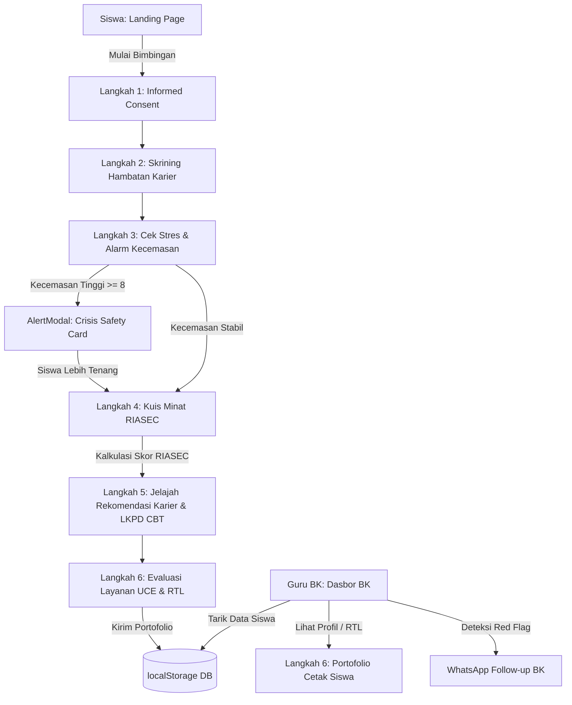

# 🗺️ RuangKarier - Development Plan (Rencana Pengembangan)

**RuangKarier** adalah portal mandiri bimbingan karier kognitif adaptif berbasis tipe kepribadian RIASEC Holland dan intervensi strategi *Cognitive Behavioral Therapy (CBT)* untuk mengelola kecemasan masa depan pasca-kelulusan bagi siswa SMA/MA/SMK.

---

## 🛠️ Stack Teknologi (Tech Stack)
- **Framework Utama:** Next.js 16.2.6 (App Router) & React 19.
- **Sistem Desain:** Tailwind CSS v4 + Vanilla CSS kustom (Google Fonts *Plus Jakarta Sans* & *Inter*).
- **Manajemen State & Data:** `localStorage` (Offline-first stateless client storage) via custom hook `useLocalStorage.ts`.
- **Ikonografi:** `lucide-react`.
- **Ekspor Dokumen:** Mekanisme cetak browser teroptimasi CSS `@media print`.

---

## 📐 Arsitektur Sistem & Alur Data

---

## 🏁 Milestones & Fase Pengembangan (Roadmap)

### Fase 1: Fondasi Proyek & Sistem Desain (Selesai ✓)
- [x] Inisialisasi aplikasi Next.js (App Router).
- [x] Konfigurasi tipografi Google Fonts dan variabel palet warna premium (*Navy Blue*, *Sage Green*, *Warm Beige*, *Accent Amber*) di `globals.css`.
- [x] Pembuatan Utilitas *Glassmorphism*, transisi melayang (*interactive hover*), dan layout cetak.
- [x] Penyusunan Shell layout global (`Navbar` & `Footer`) di `layout.tsx`.

### Fase 2: Landing Page & Komponen Dasar (Selesai ✓)
- [x] Halaman utama interaktif (`page.tsx`) dengan banner Hero dan dasbor 4 kartu panduan.
- [x] Integrasi custom hook `useLocalStorage.ts` untuk sinkronisasi database lokal.
- [x] Pembangunan komponen `RiasecChart` (SVG Radar Chart presisi tinggi).
- [x] Pembuatan komponen `AlertModal` (Safety-Trigger krisis emosional siswa).
- [x] Pembuatan repositori data statis `riasecQuestions.ts` (30 butir) dan `careerContent.ts` (6 jalur kelulusan).

### Fase 3: Stepper Kelompok Siswa & Modul Rekomendasi (Selesai ✓)
- [x] Pembangunan modul Stepper 6 langkah terstruktur di `/student/page.tsx` terlindung batas `<Suspense>`.
- [x] Pembuatan formulir Skrining Hambatan Core Beliefs.
- [x] Integrasi otomatis Safety Trigger deteksi kecemasan real-time pada Langkah 3.
- [x] Pembangunan mesin hitung RIASEC & penentu 3 Huruf Kode Holland Utama (Top 3).
- [x] Modul rekomendasi jalur pendidikan cerdas bersinkronisasi tag RIASEC & form LKPD CBT.
- [x] Lembar evaluasi UCE (*Understanding*, *Comfort*, *Action*) & Rencana Tindak Lanjut (RTL).

### Fase 4: Portofolio Cetak & Dasbor Konselor BK (Selesai ✓)
- [x] Halaman dynamic routing `/portfolio/[id]/page.tsx` dengan visual radar chart SVG dan tabel restrukturisasi kognitif CBT.
- [x] Konfigurasi printer-friendly CSS layout untuk mengonversi halaman web ke PDF resmi sekolah via `window.print()`.
- [x] Dasbor Guru BK di `/counselor/page.tsx` lengkap dengan panel KPI analitik, live alert feed Red-Flags, datatable, dan tombol simulasi data BK instan.
- [x] Integrasi tombol WhatsApp BK Follow-up otomatis.

### Fase 5: Integrasi Serverless & Database Awan (Direncanakan)
- [ ] Migrasi database lokal `localStorage` ke tabel relasional **Supabase / PostgreSQL**.
- [ ] Pembuatan modul autentikasi guru BK (Secure login) dan autentikasi akun siswa via NISN.
- [ ] Sinkronisasi real-time Dasbor BK menggunakan Supabase Realtime Listener.

### Fase 6: Ekspor PDF Mandiri & Produksi (Direncanakan)
- [ ] Integrasi engine `jspdf` atau `html2pdf` untuk mengunduh berkas portofolio PDF siswa secara langsung tanpa dialog cetak browser.
- [ ] Deployment aplikasi ke platform cloud (Vercel/Netlify).
- [ ] Uji coba beta skala terbatas dengan 10 konselor BK sekolah mitra.
