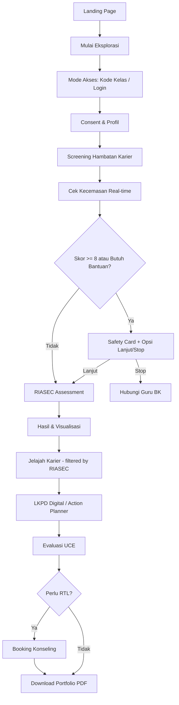

# 🧭 Eksplorasi Konsep RuangKarier — Web App Bimbingan Karier

> *"Ruang Aman Mengenali Potensi, Tempat Nyaman Merancang Masa Depan."*

---

## 1. Sintesis Dokumen Sumber

Dari 10 dokumen yang telah dipelajari, berikut peta konsep utama:

| Dokumen | Inti Kontribusi |
|:--------|:----------------|
| Gambaran Web App | Flowchart 3 aktor (Siswa, Guru BK, Admin) + 4 card dashboard |
| Gambaran Revisi | Transisi dari Google Sites → Web App terintegrasi, arsitektur modular |
| Laporan UAS BK | Landasan teoretis (Super, Bandura, Holland), panduan layanan 45 menit |
| Instrumen Eksplorasi | 6 komponen lengkap: consent → screening → anxiety check → LKPD → checklist → refleksi |
| Instrumen RIASEC | 30 item, skala 1-5, 6 dimensi, scoring top-3 |
| PRD | Scope MVP, information architecture, functional requirements, 3-phase delivery |
| Sitemap (.mmd/.png) | Alur student flow + admin subgraph |
| Schema SQL | 9 tabel PostgreSQL dengan constraints dan indexes |
| Schema JSON | Entity-relationship map + workflow sequence |

### Temuan Kunci dari Sintesis

1. **Fondasi akademis sangat kuat** — CBT + Holland/RIASEC + teori Super sudah terintegrasi
2. **Gap utama**: belum ada kode aplikasi sama sekali, hanya dokumen perencanaan
3. **Scope MVP di PRD sudah realistis** — 3 fase dengan prioritas yang jelas
4. **Schema database sudah siap pakai** — hanya perlu minor adjustment

---

## 2. Keputusan Arsitektur & Tech Stack

### Rekomendasi Final

| Layer | Teknologi | Alasan |
|:------|:----------|:-------|
| **Framework** | **Next.js 15 (App Router)** | SSR/SSG, file-based routing, API routes built-in |
| **Language** | **TypeScript** | Type safety untuk data assessment yang kritis |
| **Backend** | **Supabase** | Auth, PostgreSQL, real-time, storage — satu paket |
| **Styling** | **Tailwind CSS + shadcn/ui** | Rapid UI development, accessible components |
| **Charts** | **Recharts** | Visualisasi skor RIASEC (radar chart, bar chart) |
| **PDF Export** | **jsPDF + html2canvas** (MVP) → **pdfmake** (v2) | Client-side dulu, upgrade nanti |
| **Hosting** | **Vercel** | Zero-config untuk Next.js |
| **State** | **Zustand** | Lightweight, cocok untuk wizard multi-step |

### Mengapa Bukan Vite/React Biasa?
- Next.js memberikan **SSR untuk SEO** (landing page perlu diindeks)
- **API Routes** menghilangkan kebutuhan server terpisah
- **Middleware** untuk auth guard per-role

---

## 3. Penyempurnaan Fitur dari Dokumen Asli

### 3.1 Sistem Autentikasi

> [!IMPORTANT]
> PRD menyebutkan "login sederhana atau akses berbasis kode kelas" — ini perlu diputuskan.

**Rekomendasi: Dual-mode access**

```
Mode 1: Kode Kelas (untuk sesi bimbingan kelompok)
  → Guru BK generate kode → siswa masuk tanpa registrasi
  → Data tersimpan sementara, bisa di-claim ke akun nanti

Mode 2: Akun Siswa (untuk akses mandiri)  
  → Register dengan email/Google → data persisten
  → Bisa lihat riwayat assessment
```

### 3.2 Alur Assessment yang Disempurnakan



**Perubahan dari dokumen asli:**
- Ditambahkan **mode akses ganda**
- Safety card diberi opsi **lanjut setelah tenang** (tidak harus stop total)
- Jelajah Karier **otomatis filter** berdasarkan hasil RIASEC
- Evaluasi UCE + PDF export bisa paralel

### 3.3 Engine RIASEC Native

```
Scoring Logic:
- 30 item × skala 1-5
- Grouped: R(1-5), I(6-10), A(11-15), S(16-20), E(21-25), C(26-30)
- Total per dimensi: min 5, max 25
- Top 3 → Holland Code (misal: "SAE")
- Persentase: (skor/25) × 100%

Visualisasi:
- Radar/Spider Chart (6 sumbu RIASEC)
- Bar Chart horizontal (ranking)
- Holland Code badge besar
- Deskripsi reflektif per tipe (bukan diagnostik)
```

### 3.4 Anxiety Trigger System

```
Kondisi trigger:
  IF academic_pressure >= 8 OR graduation_anxiety >= 8 OR needs_help == true

Aksi:
  1. Tampilkan modal Safety Card (warm tone, non-judgmental)
  2. Log ke tabel anxiety_logs
  3. Kirim notifikasi ke dashboard Guru BK (real-time via Supabase)
  4. Opsi: WhatsApp deeplink ke Guru BK
```

### 3.5 Konten Jelajah Karier

| Kategori | Contoh Konten |
|:---------|:-------------|
| PTN | Info SNBP, SNBT, jalur mandiri, daya tampung |
| PTS | Beasiswa, program unggulan, akreditasi |
| PTKIN | UIN/IAIN, beasiswa Kemenag, prodi keagamaan |
| Kedinasan | STAN, IPDN, Poltek SSN, persyaratan fisik |
| Dunia Kerja | Skill demand 2026, sertifikasi, magang |
| Wirausaha | Startup, UMKM digital, modal awal |

Setiap modul punya `riasec_tags` → **smart filtering** berdasarkan kode Holland siswa.

### 3.6 LKPD Digital (CBT-Based)

Alur restrukturisasi kognitif yang sudah ada di instrumen sangat solid:

```
Step 1: Situasi & Target → "Apa impianmu?"
Step 2: Skala Tantangan → slider 1-10
Step 3: Emosi Dominan → tag selector
Step 4: Pikiran Negatif → textarea
Step 5: Fakta Penyeimbang → textarea (guided)
Step 6: Sudut Pandang Alternatif → "Nasihat untuk sahabat"
Step 7: Keyakinan Baru → afirmasi
Step 8: Checklist Tindakan → multi-select (min 3)
Step 9: Top 3 Aksi Bulan Ini → prioritas
```

**Penyempurnaan UX:**
- Setiap step = 1 halaman (wizard pattern)
- Progress bar visual
- Ilustrasi/ikon per step
- Auto-save draft ke localStorage

---

## 4. Strategi UI/UX

### 4.1 Design System

```
Color Palette:
  Primary:    Navy Blue    (#1B2A4A) — masa depan & profesionalisme
  Secondary:  Sage Green   (#7BA08A) — ketenangan & pertumbuhan
  Accent:     Warm Amber   (#F5A623) — kehangatan & optimisme
  Background: Warm Beige   (#FAF6F1) — safe space
  Surface:    White        (#FFFFFF)
  Text:       Dark Slate   (#2D3748)
  Muted:      Cool Gray    (#94A3B8)

Typography:
  Headings: "Plus Jakarta Sans" (modern, clean, Indonesian-friendly)
  Body: "Inter" (highly readable)

Spacing: 4px grid system
Border Radius: 12px (cards), 8px (buttons), 24px (pills)
```

### 4.2 Komponen Kunci

| Komponen | Deskripsi |
|:---------|:----------|
| **Hero Section** | Ilustrasi siswa optimis + CTA "Mulai Eksplorasi" |
| **4 Card Dashboard** | Grid 2×2, ikon unik, progress indicator per card |
| **Quiz Stepper** | Wizard multi-step dengan progress bar |
| **RIASEC Chart** | Radar chart interaktif + badge kode Holland |
| **Safety Modal** | Warm amber, pesan empatik, tombol WhatsApp |
| **Career Cards** | Filterable grid dengan tag RIASEC |
| **LKPD Wizard** | Step-by-step dengan auto-save |
| **PDF Preview** | Preview sebelum download |

### 4.3 Mobile-First Priorities

- Touch target minimum 44×44px
- Bottom navigation untuk mobile
- Swipeable cards
- Full-screen quiz mode
- Offline-capable untuk assessment (PWA consideration)

---

## 5. Penyempurnaan Database Schema

Schema SQL yang ada sudah bagus. Beberapa adjustment:

```diff
-- Tabel users: tambah field untuk dual-mode access
+ session_code VARCHAR(20),  -- untuk mode kode kelas
+ avatar_url TEXT,

-- Tabel baru: anxiety_logs (dari dokumen revisi, belum ada di schema)
+ CREATE TABLE anxiety_logs (
+   id UUID PRIMARY KEY DEFAULT gen_random_uuid(),
+   user_id UUID NOT NULL REFERENCES users(id) ON DELETE CASCADE,
+   academic_pressure INTEGER CHECK (academic_pressure BETWEEN 1 AND 10),
+   graduation_anxiety INTEGER CHECK (graduation_anxiety BETWEEN 1 AND 10),
+   needs_immediate_help BOOLEAN DEFAULT FALSE,
+   triggered_alert BOOLEAN DEFAULT FALSE,
+   counselor_notified BOOLEAN DEFAULT FALSE,
+   created_at TIMESTAMP NOT NULL DEFAULT NOW()
+ );

-- Tabel baru: class_sessions (untuk mode bimbingan kelompok)
+ CREATE TABLE class_sessions (
+   id UUID PRIMARY KEY DEFAULT gen_random_uuid(),
+   counselor_id UUID REFERENCES users(id),
+   session_code VARCHAR(20) UNIQUE NOT NULL,
+   class_name VARCHAR(100),
+   school VARCHAR(150),
+   is_active BOOLEAN DEFAULT TRUE,
+   expires_at TIMESTAMP,
+   created_at TIMESTAMP NOT NULL DEFAULT NOW()
+ );
```

---

## 6. Dashboard Konselor (Guru BK)

Fitur yang belum detail di dokumen asli:

| Panel | Fungsi |
|:------|:-------|
| **Overview** | Jumlah siswa aktif, sesi hari ini, alert pending |
| **Alert Center** | Siswa dengan anxiety tinggi — sorted by urgency |
| **Student List** | Filter by kelas, status assessment, kode Holland |
| **Assessment Viewer** | Detail hasil per siswa (RIASEC + screening + LKPD) |
| **Counseling Queue** | Request masuk + scheduling |
| **Reports** | Export CSV, statistik kelas, trend kecemasan |

---

## 7. Implementation Plan (3 Phase)

### Phase 1 — Core MVP (Target: 2-3 minggu)

| Task | Estimasi |
|:-----|:---------|
| Setup Next.js + Supabase + Tailwind | 1 hari |
| Landing page + design system | 2 hari |
| Auth: kode kelas + login siswa | 2 hari |
| Consent & profil form | 1 hari |
| Screening hambatan karier | 1 hari |
| Anxiety check + safety modal | 1 hari |
| RIASEC assessment (30 item wizard) | 2 hari |
| Scoring engine + visualisasi chart | 1 hari |
| LKPD Digital wizard (9 steps) | 2 hari |
| PDF portfolio export | 1 hari |

### Phase 2 — Enrichment (Target: 2 minggu)

- Jelajah Karier CMS + konten
- Smart filtering by RIASEC code
- Evaluasi layanan UCE
- Booking konseling
- Dashboard Guru BK (basic)

### Phase 3 — Polish (Target: 1-2 minggu)

- Real-time notifications
- Statistik sekolah
- Riwayat assessment siswa
- PWA + offline support
- Performance optimization

---

## 8. Struktur Folder Proyek

```
ruangkarier/
├── src/
│   ├── app/                    # Next.js App Router
│   │   ├── (public)/           # Landing, about
│   │   ├── (student)/          # Student flow
│   │   │   ├── dashboard/
│   │   │   ├── assessment/
│   │   │   │   ├── consent/
│   │   │   │   ├── screening/
│   │   │   │   ├── riasec/
│   │   │   │   └── result/
│   │   │   ├── explore/
│   │   │   ├── action-plan/
│   │   │   ├── evaluation/
│   │   │   └── portfolio/
│   │   ├── (counselor)/        # Guru BK dashboard
│   │   │   ├── dashboard/
│   │   │   ├── students/
│   │   │   ├── alerts/
│   │   │   └── reports/
│   │   ├── api/                # API routes
│   │   └── layout.tsx
│   ├── components/
│   │   ├── ui/                 # shadcn components
│   │   ├── assessment/         # Quiz, stepper, chart
│   │   ├── career/             # Career cards, filters
│   │   └── layout/             # Navbar, footer, sidebar
│   ├── lib/
│   │   ├── supabase/           # Client + server config
│   │   ├── riasec/             # Scoring engine + data
│   │   ├── pdf/                # PDF generation
│   │   └── utils/
│   ├── hooks/
│   │   ├── useAnxietyTrigger.ts
│   │   ├── useRiasecScoring.ts
│   │   └── useAssessmentProgress.ts
│   ├── stores/                 # Zustand stores
│   └── types/                  # TypeScript types
├── supabase/
│   ├── migrations/
│   └── seed.sql
├── public/
│   └── images/
└── package.json
```

---

## 9. Open Questions yang Perlu Dijawab

> [!WARNING]
> Keputusan berikut mempengaruhi arsitektur dan harus dijawab sebelum coding:

| # | Pertanyaan | Opsi | Rekomendasi |
|:--|:-----------|:-----|:------------|
| 1 | Mode akses utama? | Kode kelas / Login / Keduanya | **Keduanya** |
| 2 | PDF dikirim ke mana? | Download / Email / WhatsApp | **Download** (MVP) |
| 3 | Role Guru BK vs Admin terpisah? | Ya / Tidak | **Tidak** (MVP), pisah di Phase 3 |
| 4 | Konten karier input manual? | Manual / CMS | **Manual seed** (MVP), CMS Phase 2 |
| 5 | Bahasa UI? | Full Indonesia / Bilingual | **Full Bahasa Indonesia** |
| 6 | Hosting Supabase region? | Singapore / US | **Singapore** (latency) |
| 7 | Perlu WhatsApp API integration? | Ya / Deeplink saja | **Deeplink** (MVP), API Phase 3 |

---

## 10. Competitive Analysis

| Platform | Kelebihan | Kekurangan vs RuangKarier |
|:---------|:----------|:--------------------------|
| **Aku Pintar** | UI bagus, database kampus luas | Tidak ada CBT, tidak ada dashboard BK |
| **Xello** | Komprehensif, roadmap visual | Berbayar, tidak kontekstual Indonesia |
| **Rencanamu** | Tes minat, info kampus | Tidak ada LKPD, tidak terintegrasi BK |
| **KenaliDirimu** | Psikometri baik | Tidak ada action plan, UI kurang modern |

**Diferensiasi RuangKarier:**
- ✅ CBT-based cognitive restructuring (unik!)
- ✅ Anxiety safety trigger system
- ✅ Terintegrasi langsung dengan Guru BK sekolah
- ✅ LKPD Digital reflektif (bukan sekadar tes)
- ✅ Kontekstual SMA/MA/SMK Indonesia (termasuk PTKIN)
- ✅ Gratis dan open untuk sekolah

---

## 11. Risiko & Mitigasi

| Risiko | Dampak | Mitigasi |
|:-------|:-------|:---------|
| Koneksi internet sekolah lambat | Assessment gagal | PWA + localStorage auto-save |
| Siswa tidak serius mengisi | Data tidak valid | Gamifikasi ringan + progress reward |
| Guru BK tidak tech-savvy | Dashboard tidak terpakai | UI super sederhana + panduan video |
| Data sensitif bocor | Kepercayaan hilang | RLS Supabase + enkripsi |
| Scope creep | Timeline membengkak | Stick to MVP scope Phase 1 |

---

## Kesimpulan

Dokumen-dokumen yang ada sudah memberikan **fondasi yang sangat matang** dari sisi akademis, instrumen, dan perencanaan produk. Yang diperlukan sekarang adalah:

1. **Jawab open questions** di Section 9
2. **Mulai Phase 1** — setup proyek + landing page + core assessment flow
3. **Iterasi cepat** — ship MVP, test dengan 3-5 siswa, perbaiki

> [!TIP]
> Dengan tech stack Next.js + Supabase + Tailwind, MVP bisa live dalam **2-3 minggu** kerja fokus.
